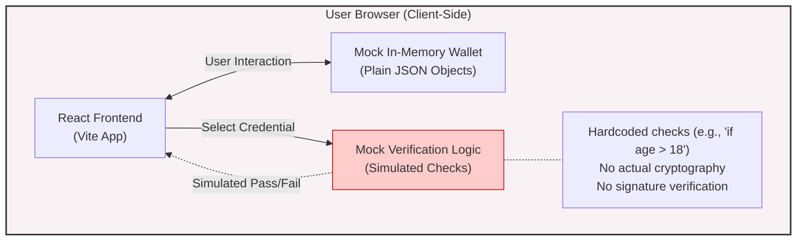
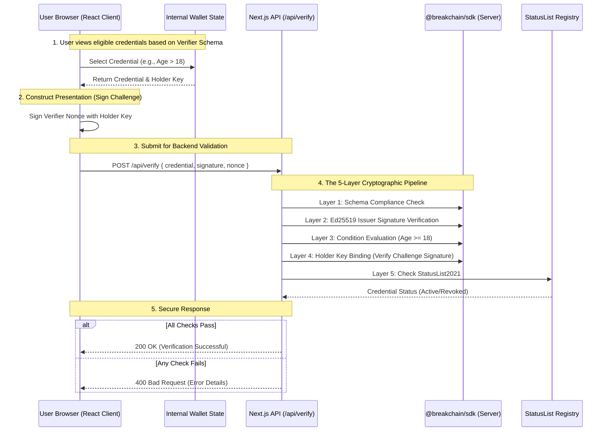
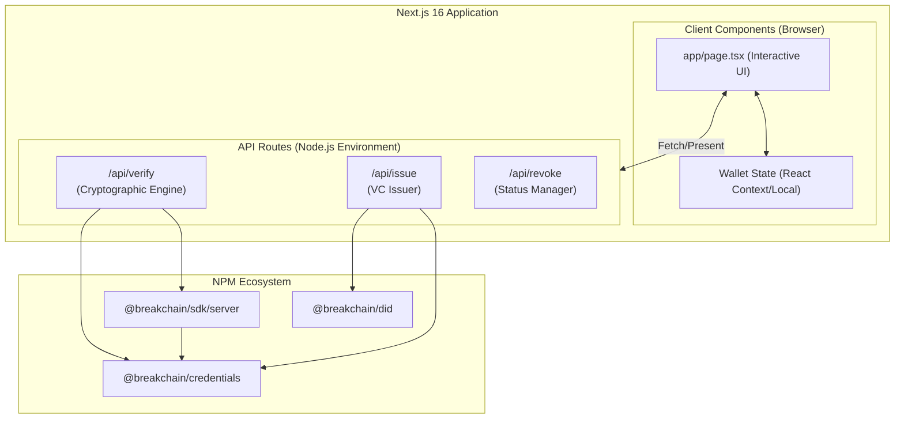

# Breakchain Showcase: Architecture Evolution (Mocked vs. Full-Stack Production)

This document outlines the architectural evolution of the Breakchain Showcase application, specifically focusing on the transition from a client-side mock implementation to a genuine full-stack, cryptographically secure architecture using Next.js and the `@breakchain/sdk`.

## 1. Previous Architecture: Client-Side Mock (Vite + React)

In the previous iteration, the showcase was a purely client-side React application built with Vite. It simulated the verification process without performing actual cryptographic checks or communicating with a trusted backend.

### Characteristics:
- **Environment**: Client-side only (Browser).
- **Framework**: Vite + React.
- **Verification Logic**: Mocked via `if (pass)` statements and hardcoded criteria.
- **Key Management**: None. No real keys were used or bound to credentials.
- **Cryptographic Operations**: Bypassed. It visually represented steps like "Checking Signatures" but did not execute actual Ed25519 signature validation.
- **Security**: Inherently insecure. A malicious user could easily modify the client-side code to bypass "verification."

### Diagram: Mocked Architecture

---

## 2. Current Architecture: Full-Stack Cryptographic Verification (Next.js)

The current iteration completely redesigns the showcase into a full-stack Next.js 16 App Router application. It utilizes genuine cryptographic primitives provided by the `@breakchain/sdk/server` and `@breakchain/credentials` packages, enforcing strict validation entirely on the server side.

### Characteristics:
- **Environment**: Full-Stack (Browser + Node.js Server).
- **Framework**: Next.js 16 (App Router).
- **Verification Logic**: Real cryptographic validation pipeline (5 Layers) executing on the backend.
- **Key Management**: In-memory ephemeral keystore (for demonstration) generating genuine Ed25519 keypairs for Issuers, Verifiers, and Holders.
- **Cryptographic Operations**: 
    - Verifiable Credential generation with real Ed25519 signatures.
    - Zero-Knowledge (ZKP) schema and condition checks.
    - Holder binding via Nonce/Challenge signatures.
    - StatusList2021 revocation registry checks.
- **Security**: Cryptographically sound. Verification happens in a trusted backend environment (`/api/verify`), preventing client-side tampering.

### Architecture Overview

1. **Client Component (`page.tsx`)**: Handles UI, user interaction, credential selection, and wallet display.
2. **Backend API (`/api/verify`)**: A secure serverless route that acts as the Verifier. It receives the presentation from the client and runs the full Breakchain validation suite.
3. **Core SDK**: The backend directly consumes `@breakchain/sdk` to perform deep cryptographic operations.

### Diagram: Full-Stack Production Architecture

### The 5-Layer Pipeline in Detail (Backend Execution)

The `/api/verify` route acts as a genuine relying party. It does not trust the client. When it receives a credential, it executes:

1. **Schema Validation**: Ensures the JSON-LD structure matches the expected credential type (e.g., `GovernmentId`).
2. **Issuer Trust**: Resolves the DID of the issuer (e.g., `did:key:...`) and mathematically verifies the Ed25519 signature on the Verifiable Credential to ensure it hasn't been tampered with.
3. **Data Integrity & Conditions**: Evaluates specific requirements against the *signed* payload data (e.g., confirming `credentialSubject.age` is actually >= 18).
4. **Holder Binding**: Verifies that the client submitting the credential actually owns it by checking the signature over the session nonce against the `holderKey` embedded in the credential.
5. **Revocation Status**: Queries the active StatusList registry to ensure the credential hasn't been revoked by the issuer since it was signed.

### Diagram: Component Hierarchy

## Summary of the Migration

- **From**: Fake, client-side, visual-only representation of ZKP and Verifiable Credentials.
- **To**: A fully functional, backend-enforced, cryptographically verifiable application utilizing the actual compiled Breakchain SDK published to the npm registry (`@breakchain/sdk@latest`).
