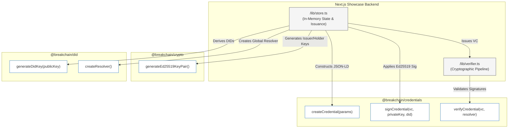
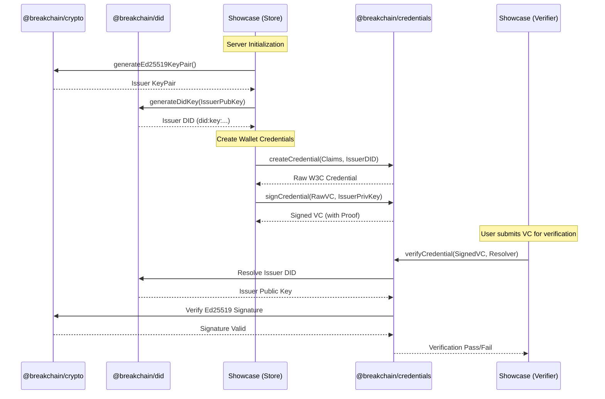

# Breakchain Showcase: SDK Low-Level Architecture

This document details how the Next.js Breakchain Showcase application integrates with the `@breakchain` ecosystem at a low level. It outlines the specific packages, exported functions, and cryptographic data flows used to issue and verify Verifiable Credentials in the showcase.

## Core SDK Integration Diagram

The showcase backend relies heavily on three core packages from the Breakchain monorepo to handle key generation, decentralized identifiers (DIDs), and credential lifecycle management.

---

## Detailed Component Breakdown

### 1. Key & Identity Generation (`@breakchain/crypto` & `@breakchain/did`)
When the showcase server initializes (via `/lib/store.ts`), it must establish identities for the **Issuer** and the **Holder**. 

1. **`generateEd25519KeyPair()`**: Imported from `@breakchain/crypto`. Generates a deterministic or random Ed25519 keypair consisting of a `publicKey` and `privateKey` (Uint8Array).
2. **`generateDidKey(publicKey)`**: Imported from `@breakchain/did`. Wraps the public key into a standardized `did:key` format (e.g., `did:key:z6Mk...`).

These functions establish the root of trust (the Issuer DID) and the binding target (the Holder DID) for the credentials.

### 2. Credential Issuance (`@breakchain/credentials`)
To generate the interactive credentials displayed in the UI wallet, the backend acts as a Virtual Issuer:

1. **`createCredential({ types, subject, issuer, ... })`**: Scaffolds a W3C-compliant Verifiable Credential object in memory. It structures the `credentialSubject` (containing claims like age, degree) and assigns the correct `@context`.
2. **`signCredential(credential, privateKey, verificationMethod)`**: Takes the raw JSON-LD object and signs it using the Issuer's private key. The `verificationMethod` explicitly points to the Issuer's DID fragment (e.g., `did:key:...#key-1`). This produces a securely signed credential with a cryptographic proof attached.

### 3. Cryptographic Verification (`@breakchain/credentials`)
When a user submits a presentation to the `/api/verify` endpoint, the `verifier.ts` pipeline executes the actual validation.

1. **`createResolver()`**: Re-used from initialization to provide a synchronous or asynchronous lookup mechanism for DIDs.
2. **`verifyCredential(rawVc, DID_RESOLVER)`**: The core verification engine. 
    - It extracts the `proof` from the credential.
    - Uses the `DID_RESOLVER` to resolve the Issuer's DID document.
    - Extracts the Issuer's public key from the DID document.
    - Mathematically verifies that the Ed25519 signature correctly matches the normalized JSON-LD payload.
    - Returns a strict `valid: true/false` result along with specific error messages if tampering is detected.

## Data Flow: Issuance to Verification

### Security Guarantees in the Showcase
By utilizing these low-level SDK functions directly in a Next.js server environment, the showcase guarantees:
1. **Zero Client-Side Trust**: The React frontend is entirely untrusted. All `signCredential` and `verifyCredential` calls happen strictly on the Node.js backend.
2. **Standard Compliance**: Uses genuine W3C Verifiable Credentials and DID resolution rather than mock JSON objects.
3. **Immutable Verification**: Any alteration to the `credentialSubject` in the browser will definitively fail the `verifyCredential` check on the server, as the signature will no longer match the payload hash.
