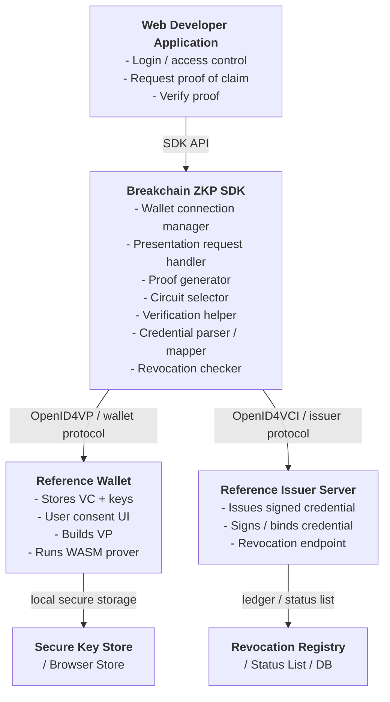

# System Architecture for ZKP Credential SDK
## 1. Purpose
This system simulates a real-world zero-knowledge verifiable credential ecosystem so that web developers can integrate a single SDK now and later switch to real issuer and wallet infrastructure with minimal change. The architecture follows the issuance, wallet storage, presentation, and proof-generation flow described in the implementation plan, especially the OpenID4VCI, OpenID4VP, browser-based proving, and revocation phases.
## 2. High-Level Architecture

## 3. Core Components
### A. Web Developer Application
This is the app that adopts the SDK. It should be able to:
 * Ask the user for a proof
 * Receive a cryptographic presentation
 * Verify it
 * Decide access based on the result
The app should not need to know how the proof is generated internally.
### B. Breakchain ZKP SDK
This is the actual product.
**Responsibilities:**
 * Connect to wallet
 * Request credential presentation
 * Choose proof format
 * Generate or trigger proof creation
 * Verify proof
 * Expose a simple developer API
**Example public API:**
```javascript
await sdk.connectWallet()
const proof = await sdk.requestProof({
  claims: ["ageOver18", "country"],
  mode: "zkp"
})
const ok = await sdk.verifyProof(proof)

```
### C. Reference Wallet
This is your simulator for the future official wallet.
**Responsibilities:**
 * Store credential securely
 * Hold private keys
 * Enforce user consent
 * Process presentation requests
 * Generate a verifiable presentation
 * Run browser/WASM proof generation when needed
This mirrors the document’s wallet and OpenID4VP flow.
### D. Reference Issuer Server
This is your simulator for the future government issuer.
**Responsibilities:**
 * Authenticate the user
 * Create a credential
 * Sign it
 * Bind it to the wallet key
 * Publish revocation state
This mirrors the issuance workflow described in the document.
### E. Secure Key Store
This should keep private keys out of application memory as much as possible.
**Examples:**
 * Android Keystore
 * iOS Secure Enclave
 * Browser secure storage fallback for demo mode
### F. Revocation Registry
This stores whether a credential is still valid.
**It can be implemented as:**
 * Database table
 * Status list credential
 * Merkle-tree-based revocation list
The document’s revocation phase clearly expects this capability.
## 4. Runtime Flow
### Flow 1: Credential Issuance
 1. User authenticates with the reference issuer.
 2. Issuer creates a signed verifiable credential.
 3. Credential is bound to the wallet’s public key.
 4. Wallet stores the credential securely.
*This follows the OpenID4VCI-style issuance sequence in the document.*
### Flow 2: Proof Request from a Website
 1. Web app calls the SDK.
 2. SDK creates a presentation request.
 3. Wallet receives request.
 4. User approves sharing.
 5. Wallet selects the needed credential.
 6. Wallet generates proof or presentation.
 7. SDK returns proof to the website.
 8. Website verifies the proof.
*This matches the OpenID4VP presentation flow and selective disclosure design.*
### Flow 3: Zero-Knowledge Proof Generation
 1. Wallet loads the chosen circuit.
 2. Credential data is converted into circuit inputs.
 3. Witness is generated locally.
 4. WASM prover creates the proof.
 5. Proof is returned to SDK and then to the verifier.
*This aligns with the browser-based proving architecture in the document.*
### Flow 4: Verification
 1. Web app sends the proof to SDK or verifier backend.
 2. SDK checks proof format and public inputs.
 3. Verifier checks proof against verification key.
 4. Verifier checks revocation status.
 5. Access is granted or denied.
## 5. Suggested Module Breakdown
```text
sdk/
  core/
    wallet-connector
    proof-orchestrator
    verifier-client
    claim-parser
    revocation-client
  crypto/
    poseidon
    merkle
    key-binding
    signature-verification
  circuits/
    age-over
    nationality
    custom-claims
  prover/
    witness-generator
    wasm-runner
    proof-serializer
  protocols/
    openid4vci
    openid4vp
    sd-jwt
    did
  adapters/
    browser
    mobile
    api

```
## 6. Trust Boundaries
The architecture should enforce these boundaries:
 * User private keys never leave the wallet
 * Issuer signing key stays inside issuer server or HSM
 * SDK never directly reads raw private keys
 * Website only receives proof, not raw credential
 * Revocation is checked independently before acceptance
These boundaries are consistent with the document’s emphasis on user-controlled keys and local proving.
## 7. Deployment Model
### Demo Mode
 * Local issuer server
 * Local wallet simulator
 * Local verifier demo site
 * Local proof circuits
 * Local revocation database
### Real Ecosystem Mode
 * Official issuer endpoint replaces simulator
 * Official wallet replaces simulator
 * SDK stays the same
 * Only configuration, trust anchors, and endpoints change
## 8. What Makes This Architecture Strong
 * It is realistic enough to simulate a government-issued credential ecosystem.
 * It is modular enough that the SDK remains reusable.
 * It separates standards from implementation.
 * It allows you to demonstrate both the happy path and the proof/revocation/security path.
## 9. Recommended Project Positioning
Present the project as:
> “A standards-based ZKP credential SDK with reference issuer and wallet simulators for future government adoption.”
> 
That phrasing makes the purpose clear: the simulators prove interoperability, while the SDK is the deliverable developers actually integrate.
