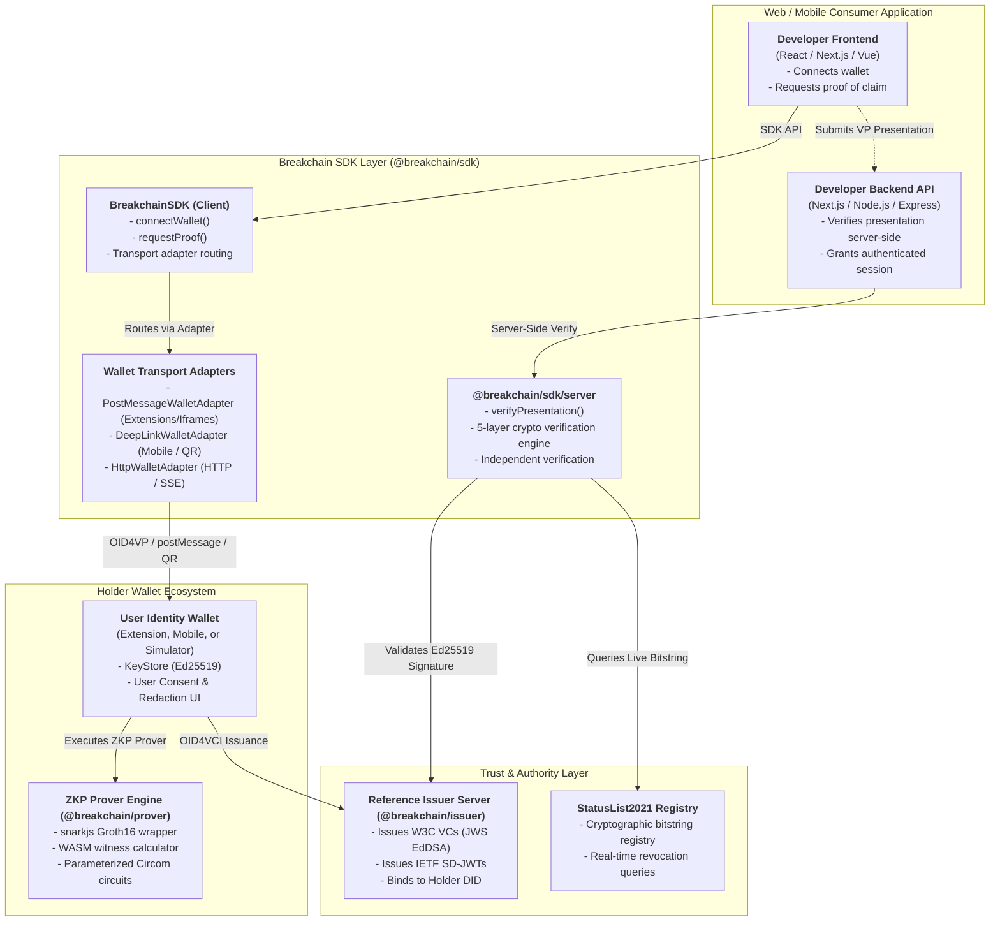

# System Architecture for Breakchain ZKP Credential SDK

## 1. Purpose
The Breakchain SDK provides a production-grade, standards-based Zero-Knowledge Proof credential ecosystem so web developers can integrate privacy-preserving identity verification today with a single SDK. The architecture adheres to **W3C Verifiable Credentials v2**, **W3C Decentralized Identifiers (DID)**, **OpenID for Verifiable Presentations (OID4VP)**, **OpenID for Credential Issuance (OID4VCI)**, **DIF Presentation Exchange v2**, **IETF SD-JWT**, and **Groth16 ZK proofs** (snarkjs + Circom).

---

## 2. High-Level System Architecture



---

## 3. Core Components

### A. Web Developer Frontend
The consumer-facing web or mobile interface integrating `@breakchain/sdk`:
* Connects to the user's wallet via browser extensions, iframes, or QR codes.
* Issues structured presentation requests using DIF Presentation Exchange schemas (e.g. `age >= 21`, `nationality == 356`, `degree == 'B.Tech'`).
* Receives cryptographic proofs and forwards them to the application's backend.
* **Privacy Guarantee**: 0 bytes of sensitive raw identity data (birthdate, Aadhaar/SSN, full address) are ever transmitted to or stored on the consumer frontend.

### B. Breakchain SDK (`@breakchain/sdk`)
The core integration product providing dual client-side and server-side interfaces:

1. **Client-Side SDK (`@breakchain/sdk`)**:
   ```typescript
   import { BreakchainSDK } from '@breakchain/sdk';

   const sdk = new BreakchainSDK({ walletAdapterType: 'postMessage' });
   await sdk.connectWallet();

   const result = await sdk.requestProof({
     claims: [{ field: 'age', condition: '>=21' }],
     mode: 'zkp'
   });
   ```

2. **Server-Side Verifier (`@breakchain/sdk/server`)**:
   ```typescript
   import { verifyPresentation } from '@breakchain/sdk/server';

   const verification = await verifyPresentation(presentation, {
     revocationCheck: true
   });
   ```

### C. Multi-Transport Wallet Adapters
Enables applications to communicate with any wallet deployment form factor:
* **`PostMessageWalletAdapter`**: Communicates with browser extensions and embedded iframes via `window.postMessage` RPC protocols.
* **`DeepLinkWalletAdapter`**: Generates standardized `openid4vp://` URIs for native mobile wallet application deep links and desktop QR code scanning.
* **`HttpWalletAdapter`**: Direct REST/SSE transport for standalone wallet backend servers.

### D. Parameterized Zero-Knowledge Prover (`@breakchain/prover` & `@breakchain/circuits`)
* Built with **Circom 2.x** and **snarkjs** on the `bn128` elliptic curve with Poseidon hash commitments.
* **Dynamic Parameterization**: Circuits like `age_over.circom` accept dynamic threshold signals (`signal input ageThreshold;`), allowing a single compiled circuit to prove arbitrary thresholds (e.g. `18+`, `21+`, `65+`) without recompiling.
* Prover compiles to WebAssembly (WASM) for local, private client-side execution in browsers and mobile devices.

### E. Reference Holder Wallet (`@breakchain/wallet`)
* Manages Ed25519 identity keypairs (`did:key:...`).
* Stores W3C Verifiable Credentials and SD-JWTs in an isolated keystore.
* Renders user consent prompts and manages selective disclosure redactions.
* Executes witness generation and Groth16 proofs locally before returning Verifiable Presentations.

### F. Reference Issuer Server (`@breakchain/issuer`)
* Authoritative issuing service implementing OpenID for Verifiable Credential Issuance (OID4VCI).
* Cryptographically signs credentials using `Ed25519Signature2020` / JWS.
* Maintains real-time cryptographic revocation state via W3C StatusList2021 bitstrings.

---

## 4. The 5-Layer Cryptographic Verification Pipeline

Verification in Breakchain executes through an itemized 5-layer pipeline to guarantee complete mathematical and operational integrity:

```
┌─────────────────────────────────────────────────────────────┐
│ 1. Schema Attribute Check                                   │
│    Verifies credential schema contains requested attribute  │
│    (Rejects incompatible credentials e.g. Degree for Age)   │
├─────────────────────────────────────────────────────────────┤
│ 2. Issuer Authority Signature Check                         │
│    Resolves Issuer DID (did:key / did:web) and verifies     │
│    Ed25519 digital signature over the credential            │
├─────────────────────────────────────────────────────────────┤
│ 3. Mathematical Claim Condition Proof                       │
│    Evaluates Groth16 ZK proof verification equation or      │
│    SD-JWT salted hash digest match against condition        │
├─────────────────────────────────────────────────────────────┤
│ 4. Holder Key Binding (Anti-Theft Defense)                  │
│    Verifies presenter signed server nonce with private key  │
│    matching holder DID (blocks stolen token replay attacks) │
├─────────────────────────────────────────────────────────────┤
│ 5. Real-Time Revocation Status Check                        │
│    Queries issuer's StatusList2021 registry to verify       │
│    the credential is not suspended or revoked               │
└─────────────────────────────────────────────────────────────┘
```

---

## 5. End-to-End Runtime Flows

### Flow 1: Credential Issuance (OID4VCI)
1. User authenticates with the credential issuer (e.g., National ID Portal, University NAD).
2. Issuer creates a W3C Verifiable Credential embedding holder claims.
3. Issuer cryptographically signs the credential with its private Ed25519 key.
4. Credential is bound to the holder's `did:key` identifier.
5. Wallet securely stores the signed credential in its local keystore.

### Flow 2: Zero-Knowledge Presentation & Verification (OID4VP)
1. Consumer application initializes `@breakchain/sdk` and requests a claim proof (`age >= 21`).
2. SDK dispatches presentation request via the configured wallet adapter.
3. Wallet inspects available credentials and classifies them:
   * **Eligible**: Has attribute and satisfies threshold.
   * **Ineligible**: Has attribute but fails threshold.
   * **Incompatible**: Lacks required attribute.
4. User selects an eligible credential and grants consent.
5. Prover engine calculates private witness and generates Groth16 proof:
   $$\pi = \text{Groth16.prove}(pk, \text{witness})$$
6. Wallet wraps proof and cryptographic nonce signature into a Verifiable Presentation.
7. Application backend verifies presentation via `@breakchain/sdk/server`:
   * Checks issuer signature, Groth16 pairing, holder key binding, and StatusList revocation.
8. Backend issues authenticated session token. Zero PII is stored.

---

## 6. Trust & Security Boundaries

* **No Private Key Leakage**: User private keys never leave the wallet boundary; server keys never leave the issuer boundary.
* **Zero PII Exposure**: Verifier websites receive only zero-knowledge proofs or selectively disclosed claims. Raw identity scans (Aadhaar, passport, transcripts) are never transmitted.
* **Anti-Replay & Non-Transferability**: Holder key binding challenges prevent stolen or copied presentations from being replayed by unauthorized parties.
* **Server-Side Enforcement**: Verification is always enforced server-side via `@breakchain/sdk/server` to prevent client-side DOM tampering.

---

## 7. Reference Full-Stack Showcase Implementation

A complete full-stack integration showcase is implemented in `breakchain-showcase`:
* **Framework**: Next.js App Router (v16.3.6 / React 19 / Turbopack).
* **Consumer Apps**: 21+ Esports Tournament, National Citizen Subsidy Portal, TechCareers B.Tech Degree Verification.
* **Live Server APIs**: Real cryptographic signing and verification via `/api/verify`, `/api/issue`, and `/api/revoke`.
* **Dynamic Verification**: Real-time evaluation across all 5 verification layers with live latency measurement.
