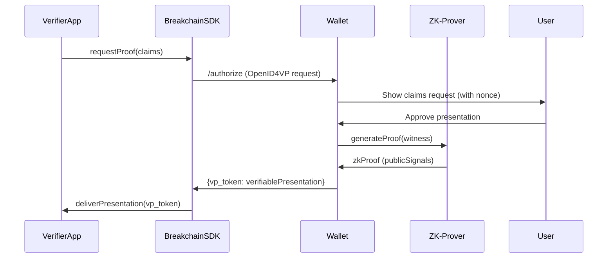
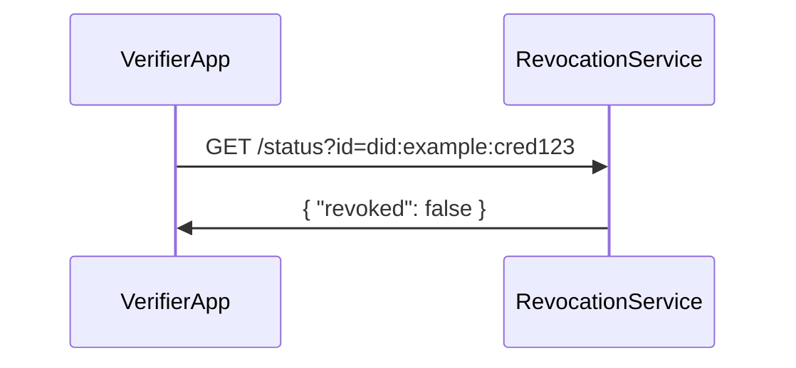
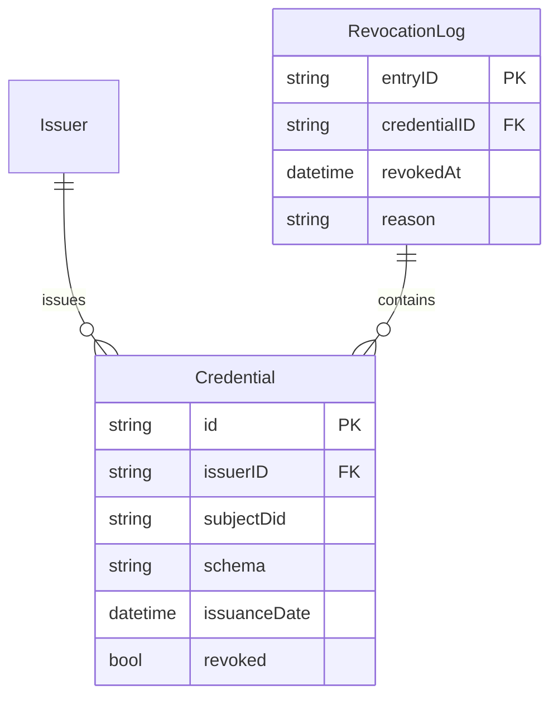
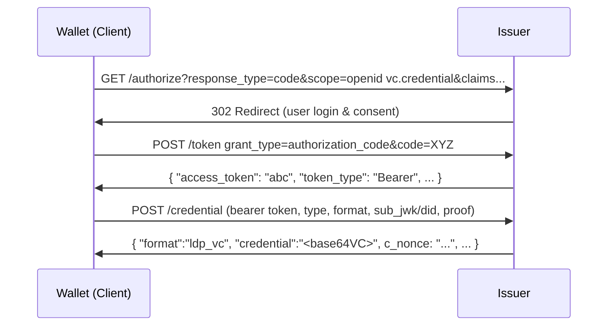
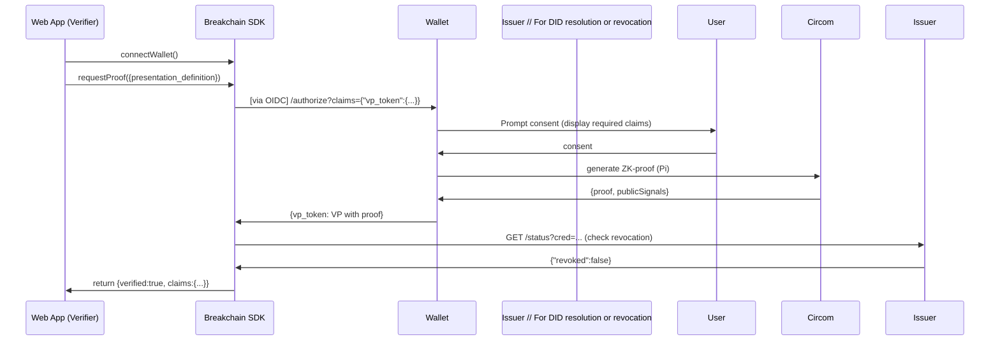
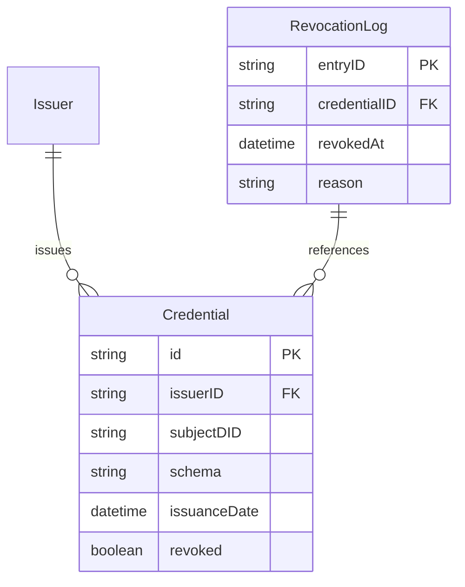

# ZKP Credential Ecosystem: Low-Level Architecture

**Executive Summary:** This report details the low-level architecture of a verifiable-credential (VC) ecosystem with zero-knowledge proofs (ZKPs), covering all major entities and interactions. We analyze each component—**Reference Issuer**, **Reference Wallet**, **Breakchain ZKP SDK**, **Web Developer App**, **Secure Key Store**, and **Revocation Registry**—in terms of responsibilities, APIs, data models (e.g. JSON-LD VCs, SD-JWTs), cryptography (signatures, keys, ZK circuits), protocol flows (OpenID4VCI, OpenID4VP, DID resolutions), state machines and errors, security/storage considerations, and performance constraints. We also enumerate concrete libraries (e.g. SnarkJS, Circom, Noir, Barretenberg, DID tooling) and compare implementation choices (e.g. WASM vs remote proving, did:key vs did:web, BBS+ vs SD-JWT). Integration contracts are illustrated with Mermaid sequence diagrams and an ER chart. Wherever possible we cite primary sources (W3C, OpenID, IETF).

## Reference Issuer (VC Issuance Service)

**Responsibilities:** The Issuer creates and signs credentials for holders. In an OpenID4VCI flow, it performs OAuth-style authentication and authorization (if applicable), issues VCs bound to holder keys/DIDs, publishes issuer metadata, and optionally maintains credential manifests and revocation data. It must track which credentials have been issued (for revocation) and enforce policies (e.g. proof of eligibility).  

**APIs (Endpoints):** Following the OpenID Connect for Verifiable Credential Issuance (OIDC4VCI) spec, the Issuer exposes:  
- **Authorization Endpoint** (`/authorize`): initiates holder authentication and VC issuance request. (Standard OpenID Connect flows apply.)  
- **Token Endpoint** (`/token`): exchanges auth code for `access_token` or an `authorization_error`.  
- **Credential Endpoint** (`/credential`): a POST where the client (wallet) requests issuance of a specific credential type.  Required parameters (as `application/x-www-form-urlencoded`) include:
  - `type` (VC schema or manifest URL).  
  - `format`: desired credential format (e.g. `ldp_vc` for JSON-LD, `jwt_vc` or custom such as `SD-JWT`).  
  - **Binding**: either `sub_jwk` *or* `did` (mutually exclusive) to bind the VC to a public key or DID of the holder.  
  - Optional `proof`: a proof-of-possession (e.g. a JWS or Linked Data proof) of the key in `verificationMethod` to prevent replay.  

  **Credential Request Example (non-normative):**  
  ```http
  POST /credential HTTP/1.1
  Authorization: BEARER <access_token>
  Content-Type: application/x-www-form-urlencoded

  type=https%3A%2F%2Fexample.com%2Fcredentials%2FIDCard
  &format=ldp_vc
  &did=did%3Akey%3AzExampleDid
  &proof={...JWS or LD proof...}
  ```  
  (Issuers may also support deferred issuance via an `acceptance_token`.)  

- **Credential Response:** On success, Issuer returns either the encoded VC (`credential` field) or an `acceptance_token` (for deferred issuance), along with optional parameters. The VC is typically delivered as a Base64URL-encoded JSON string (for LDP or SD-JWT) in the `credential` parameter. Example response fields (JSON):  
  ```json
  {
    "format": "ldp_vc",
    "credential": "<Base64URL of signed VC JSON-LD>",
    "c_nonce": "<nonce for next binding proof>",
    "c_nonce_expires_in": 3600
  }
  ```  
  (See **Data Models** below for sample VC content.) The Issuer must sign the VC (see **Crypto**).  

**Data Models:** Issuer outputs a **Verifiable Credential** according to W3C VC Data Model. For example, a JSON-LD credential (simplified) might look like:  
```json
{
  "@context": ["https://www.w3.org/ns/credentials/v2", "https://www.w3.org/ns/credentials/examples/v2"],
  "id": "https://university.example/credentials/58473",
  "type": ["VerifiableCredential", "ExampleAlumniCredential"],
  "issuer": "did:example:2g55q912ec3476eba2l9812ecbfe",
  "issuanceDate": "2023-01-01T00:00:00Z",
  "credentialSubject": {
    "id": "did:example:ebfeb1f712ebc6f1c276e12ec21",
    "alumniOf": {
      "id": "did:example:c276e12ec21ebfeb1f712ebc6f1",
      "name": "Example University"
    }
  },
  "proof": {
    "type": "Ed25519Signature2018",
    "created": "2023-01-01T01:00:00Z",
    "verificationMethod": "did:example:2g55q912ec3476eba2l9812ecbfe#keys-1",
    "proofPurpose": "assertionMethod",
    "jws": "eyJhbGciOiJFZERTQSIs..."
  }
}
```
(This example is **illustrative**; implementers must adapt the VC schema and contexts to their use case.) In alternate designs the issuer might deliver a **JWT-based VC** or an **SD-JWT**. For SD-JWT, the issuer encodes claim digests (`"_sd"`) as per RFC 9901, e.g.:  
```json
{
  "iss": "https://issuer.example.com",
  "iat": 1683000000,
  "exp": 1883000000,
  "_sd": ["C9inp6YoRaEX...", "..."],
  "credentialSubject": {
    "id": "did:example:holder",
    "given_name": "Alice",
    "birthdate": "1980-01-01",
    "address": {
      "_sd": ["6aUhzY..."],
      "street_address": "123 Main St", 
      "locality": "Tokyo",
      "country": "JP"
    }
  }
}
```
Here each `_sd` array entry is a Base64URL digest of the associated claim. The SD-JWT format supports selective disclosure by allowing the holder to reveal only chosen claims (see **Data Models** and **Crypto**).

**Cryptographic Operations:** The Issuer must **sign** each VC with its private key. Common choices: Ed25519 (Linked Data Signature with `Ed25519Signature2018` or JWS-EdDSA) or ECDSA/P-256 (JWS-ES256). For example, the OIDC4VCI spec’s non-normative VC request uses `RsaSignature2018` with JWS; equivalently one could use `Ed25519Signature2018` proofs or `JsonWebSignature2020` for JWK-based keys. The `verificationMethod` in the VC’s `proof` refers to a public key (often a DID URL fragment). The Issuer must also possibly verify the `proof` from the holder’s request (checking the holder’s signature of the `sub_jwk` or DID binding) before issuing. Key types and binding: *`sub_jwk`* supplies a JWK public key directly (the issuer binds the VC to that key); *`did`* supplies a DID and the Issuer expects the holder to prove control (see Section 7.1 Security Considerations). Revocation: the issuer may also cryptographically sign or hash entries in a revocation registry (see **Revocation Registry**).  

**Protocol Flow (OIDC4VCI):** The issuance flow follows the OpenID4VCI sequence:  

```mermaid
sequenceDiagram
  participant W as Wallet (Holder)
  participant I as Issuer
  W->>I: GET /authorize?response_type=code&scope=openid+vc.credential&
               claims={"credentials":{"type":"IDCard","manifest":"..."}}
  I->>W: 302 Redirect (User login + consent)
  W->>I: POST /token grant_type=authorization_code (auth code)
  I->>W: { "access_token": "abc123" }
  W->>I: POST /credential (bearer token, type, format, [sub_jwk|did], proof)
  I->>W: { "format":"ldp_vc", "credential":"<base64VC>", ... }
```

- The Wallet first obtains an **authorization code** (or token) via `/authorize` and `/token`, per OpenID Connect. The **Credential Endpoint** (`/credential`) is then called with the valid bearer token and request parameters. The Issuer returns the signed VC in the HTTP response. (TLS is mandatory for all endpoints.) The Issuer may also require a nonce-based proof of binding via a `c_nonce` mechanism.  

**State Machine & Errors:** The Issuer transitions from *Idle* → *Authenticating User* → *Issuing Credential* → *Completed*. Errors include invalid requests (400 Bad Request for missing params), invalid tokens (401/403), or proof failures (e.g. invalid DID control proof). Examples: malformed `sub_jwk`, missing `type`, or proof nonce mismatch. The Issuer returns standard OAuth2/OpenID error JSON (e.g. `error=invalid_request`) on failure.  

**Security Considerations:** Following the spec, all communication uses HTTPS. The Issuer must validate the holder’s control of the requested key: if a `did` is provided, verify the `proof.verificationMethod` corresponds to that DID and that the holder signed the challenge. The Issuer must also protect its own private keys (e.g. use an HSM). Nonces (`c_nonce`) prevent replay. Ensure response tokens (credentials) are encrypted or integrity-protected (JWE/JWS) as needed. See OpenID4VCI Security considerations.  

**Storage & Formats:** The Issuer stores credential metadata for auditing/revocation. A database table might log each issued VC (id, subject DID, issuance timestamp, status). If using W3C StatusList2021, Issuer also maintains a bitstring of revocation status (see **Revocation Registry**). Stored VCs themselves can be JSON-LD in a document store or their Base64 form in a DB. Schema/context files (JSON-LD @context) should be published at stable URLs as per W3C guidance.  

**Performance:** Credential signing is lightweight, but support for issuing many credentials per second depends on platform. If using RSA, ECDSA or EdDSA, each signature is sub-millisecond on modern hardware. The heavy work (ZKP proof) is done by the holder, not here. For large-scale issuance, use stateless JWT issuance or scalable microservices.  

**Libraries/Frameworks:** Possible stacks include Node.js or Python. Popular libraries:
- **OpenID Connect/OAuth**: [openid-client](https://www.npmjs.com/package/openid-client) (Node), or Authlete reference implementation.  
- **VC Issuance**: [Sphereon oid4vci-client](https://www.npmjs.com/package/@sphereon/oid4vci-client) (OIDC4VCI client), or [Walt.ID OIDC4VC (Kotlin)](https://github.com/walt-id/waltid-openid4vc).  
- **VC Signing**: [jsonld-signatures](https://github.com/digitalbazaar/jsonld-signatures) (Digital Bazaar) for Linked Data proofs (e.g. Ed25519Signature2018) or [vc-js](https://github.com/digitalbazaar/vc-js). For SD-JWT, any JWT library (e.g. node-jose) can be used to produce the JWS.  
- **DID Handling**: [did-jwt](https://github.com/decentralized-identity/did-jwt), [did-resolver](https://github.com/decentralized-identity/did-resolver) for resolving `did:web` or `did:key`.  
- **Web Framework**: Express/Koa (Node) with OAuth support, or [oidc-provider](https://github.com/panva/node-oidc-provider) for custom OIDC flows.  

**Deployment:** Can run on cloud servers. The Issuer’s endpoints should be public URLs (e.g. `https://issuer.example.com`). For `did:web` issuers, the DID Document must be hosted on a TLS-secured webserver (see [38†L157-L164]). Keys should reside in a secure store (HSM or KMS). Use Docker for portability. 

**Recommended Stack (Issuer):** A Node.js/Express server using `oidc-provider` configured for VC issuance, with `jsonld-signatures` for signing, and a backing PostgreSQL store for revocation/status. Rationale: leverages standards (OIDC4VCI) and mature JS libraries, easy JWT handling. Use `did:web` for issuer DID (full control, updatable DID doc). 

## Reference Wallet (Holder Client)

**Responsibilities:** The Wallet holds the user’s VCs and keys, runs ZK circuits, and presents proofs to Relying Parties. It stores credentials (VCs/SD-JWTs), manages user consent, and interacts with the issuer during issuance and with apps during presentation. The Wallet also manages the user’s identity (DID/keypair) for proving ownership.  

**APIs (Endpoints & Interfaces):** The Wallet is primarily a user agent (mobile or web), but for our simulation it exposes endpoints for receiving OIDC requests and returning VPs. For example:  
- **OIDC4VCI Callback**: an endpoint (e.g. `https://wallet.example.com/callback`) that handles the OAuth2 redirect after `/authorize`. On receipt of the auth code and tokens, it calls `/token`, then `/credential`, receives and stores the VC.  
- **Presentation Request/Response**: the Wallet acts as an OpenID Provider in OIDC4VP or a Self-Issued OIDC (SIOPv2). It must implement an authentication endpoint (initiated by RP) and return an `id_token`/`vp_token` containing the Verifiable Presentation. In practice, the **Breakchain SDK** will drive the wallet, but at minimum the Wallet SDK exposes functions like `generatePresentation(presentationDefinition)` that builds a VP matching a DIF Presentation Exchange request.  

In code, the Wallet connector might look like:
```typescript
// Example: Simplified Wallet connector logic (TypeScript)
async function handleAuthRequest(request) {
  // `request` contains OpenID claims including `vp_token.presentation_definition`
  const creds = findCredentialsMatching(request.vp_token.input_descriptors);
  const userApproved = await promptUserConsent(creds, request.vp_token);
  if (!userApproved) throw new Error('UserDenied');
  // Prepare verifiable presentation
  const presentation = await createVerifiablePresentation(creds, request.nonce);
  return { id_token: jwtIdToken, vp_token: presentation };
}
```
*(Here `createVerifiablePresentation` signs/packs the VCs into a VP, possibly running ZK proof on attributes.)*  

**Data Models:** The Wallet stores VCs as received (JSON-LD objects or JWTs). It also issues a **Verifiable Presentation (VP)** when requested. A VP (JSON-LD) contains `@context`, `"type": ["VerifiablePresentation"]`, a `verifiableCredential` array of included VCs (possibly selectively disclosed), and a `proof` of the holder’s signature. For example:  
```json
{
  "@context": ["https://www.w3.org/ns/credentials/v2"],
  "type": ["VerifiablePresentation"],
  "verifiableCredential": [<credential objects>],
  "proof": {
    "type": "Ed25519Signature2018",
    "created": "2023-01-02T10:00:00Z",
    "verificationMethod": "did:key:xyz#key-1",
    "proofPurpose": "authentication",
    "challenge": "<nonce>",
    "jws": "..."
  }
}
```  
Alternatively, the VP can be a JWT (`vp_token`) containing one or more VPs. For SD-JWT credentials, the VP may include disclosure proofs per RFC 9901.  

**Cryptographic Operations:** The Wallet holds the holder’s private keys (often Ed25519 or ECDSA). For each presentation it must sign the VP to prove control of a DID (proofPurpose=authentication). If using Linked Data proofs, it creates an `Ed25519Signature2018` (or newer `JcsEd25519Signature2020`) on the VP JSON-LD. If using JWT VP, it signs an `id_token` with `vp_token` claim (OpenID4VP allows embedding). Critically, the Wallet runs ZK proof generation: given a circuit (e.g. “ageOver18” or compound), it computes the ZK-SNARK proof (e.g. using Circom+snarkjs or Noir) off-chain. This uses hash functions (e.g. Poseidon) inside the circuit. The Wallet must then include the proof in the output VP (in `proofValue` or as part of the payload) along with any public signals. For BBS+ scheme, if used, it would generate a ZK-proof of subset of credential statements.  

**Protocol Flows (OIDC4VP):** The Relying Party (RP/web app) requests a presentation via OpenID Connect. For example, using SIOPv2, the RP redirects to the Wallet (acting as Self-Issued OP) with a `claims` request containing `vp_token.presentation_definition` (DIF Presentation Exchange). The Wallet then authenticates (user unlocks wallet), collects the required credential(s), generates the VP (and any ZK proofs), and returns an `id_token` (if SIOP) and/or `vp_token` containing the VP. 

A high-level presentation flow:  

*(All interactions occur over HTTPS. The SDK abstracts away these OIDC calls.)*

**State Machine & Errors:** States: *Idle* → *Auth Request Received* → *User Consent* → *Proving* → *Presenting*. Errors include: missing credential, user denies request, proof generation failure, or VP not matching definition. Errors should be communicated as OIDC errors (`access_denied`, `invalid_request`, etc.) or exceptions in SDK calls. For example, if no matching credential is found for the requested `input_descriptors`, the wallet returns an error to the RP. 

**Security:** Keys are critical: the Wallet’s private key never leaves the device. Proof generation and VC processing should occur in a secure environment. Nonces from the RP must be included in the VP `proof.challenge` to prevent replay. If using `did:key`, the DID is tied to the public key itself, so no external registry lookup is needed (but key rotation is impossible). If `did:web`, the wallet would resolve the issuer’s DID to verify issuer signature. The Wallet must also check issuer and signature on any received VC during issuance.  

**Storage:** The Wallet stores credentials (JSON objects or serialized JWTs) in encrypted local storage or secure enclave. A simple simulation might store them in an in-memory Map or file. Keys are stored via the Secure Key Store (next section). 

**Performance:** Proof generation is the heaviest task. Running SNARK circuits on-device (via WASM) can take seconds for moderate circuits. Using libraries like [snarkjs](https://github.com/iden3/snarkjs) or [Noir](https://noir-lang.org) (compiled to WASM) is feasible in modern devices but has latency. Alternatively, the Wallet might offload to a remote prover service (with privacy trade-offs). We compare WASM vs remote below. Signature operations (EdDSA) are fast (<1ms). 

**Libraries/Frameworks:** 
- **Wallet App**: Could be a mobile app (React Native, TrustWallet, Inji) or a web extension. For JS prototyping, use [@digitalbazaar/verifier](https://github.com/digitalbazaar/vc-verifier) or [Walt.ID Wallet Kit](https://github.com/walt-id/waltid-wallet-common).  
- **DID/Keys**: [DIDKit](https://github.com/spruceid/didkit) or [key-did-provider-ed25519](https://github.com/multiformats/js-did-key) for `did:key` generation.  
- **JSON-LD**: `jsonld` npm package for context expansion, and [`jsonld-signatures`](https://github.com/digitalbazaar/jsonld-signatures) for verifying LD proofs.  
- **ZKP**: [circom](https://docs.circom.io/) + [snarkjs](https://github.com/iden3/snarkjs) (TS/JS), [noir-lang](https://noir-lang.org/) (Rust/ts), or [barretenberg](https://barretenberg.aztec.network/) (C++/WASM) for specific primitives.  
- **Credential Processing**: [vc-js](https://github.com/digitalbazaar/vc-js) can assemble VPs; [did-resolver](https://github.com/decentralized-identity/did-resolver) to resolve issuer DIDs.  
- **OpenID Connect**: [oidc-client-ts](https://github.com/authts/oidc-client-ts) for SIOPv2 flows in SPAs.  

**Recommended Stack (Wallet):** A TypeScript-based web/mobile wallet using `did:key` for holder identity (no server dependency). Use [circom/snarkjs] in WASM for proof on the client. For VC storage/use, use `vc-js`/`jsonld-signatures`. For OIDC, implement SIOPv2 or OpenID4VP flows via `oidc-client-ts`. This maximizes decentralization (did:key, local proofs) and leverages JS libraries. 

## Breakchain ZKP SDK

**Responsibilities:** The Breakchain SDK bridges the Web App (Verifier) and the Wallet. It provides a developer-facing API to initiate proof requests, communicate with the wallet, and verify received proofs. It abstracts away cryptographic details and protocols. Specifically, it: 
- Initiates OIDC4VP or custom flows to the Wallet.  
- Asks the Wallet for specific proofs/claims (per a JSON definition).  
- Receives verifiable presentations (with ZK proofs) from the Wallet.  
- Runs local verification of the ZK proof and the VC signatures.  
- Returns a boolean or extracted claims to the Web App.  

**APIs (Example TypeScript):**  

```typescript
// Initialize and connect to a wallet (returns a session)
const breakchain = new BreakchainSDK({ walletUrl: 'https://wallet.example.com' });
await breakchain.connectWallet();  

// Request a proof for specific attributes via a named circuit
const proofResult = await breakchain.requestProof({
  claims: [
    { field: "age", condition: ">=18" },
    { field: "citizenship", equals: "India" }
  ],
  circuit: "ageAndCitizenshipCheck"
});
if (proofResult.error) {
  console.error("Proof generation failed:", proofResult.error);
} else {
  console.log("Proof and data:", proofResult);
}

// On receiving a presentation, verify it:
const isValid = await breakchain.verifyPresentation(proofResult.presentation);
if (isValid) {
  console.log("Proof is valid, data:", proofResult.revealedData);
} else {
  console.error("Invalid proof");
}
```

Under the hood, the SDK’s `requestProof()` assembles an OIDC request to the wallet (embedding a DIF presentation_definition for the needed attributes), manages the redirect or popup, and awaits the response. The response contains a verifiable presentation with the ZK proof.

**Data Models:** The SDK handles:  
- **Presentation Definitions:** a JSON object (DIF PE format) specifying required credentials/attributes (similar to the OIDC examples).  
- **Verifiable Presentations:** JSON-LD objects or JWS containing the proof. The SDK knows how to parse LD proofs or JWT proofs out of the `vp_token`. It extracts the underlying credential(s) and any disclosed claims.  
- **ZK Proof Objects:** Depending on the ZK library, a proof consists of `{pi_a, pi_b, pi_c}` plus `publicSignals`. The SDK must feed the right data into the verifier (see below).  

**Cryptographic Ops:** The SDK performs **proof verification**. For example, with snarkjs (Groth16):  
```javascript
const vKey = await snarkjs.zKey.exportVerificationKey(zkeyFile);
const verified = await snarkjs.groth16.verify(vKey, proofResult.publicSignals, proofResult.proof);
```
For Noir/Barretenberg, a similar API exists. The SDK also verifies the holder’s signature on the VP (e.g. using the DID and public key). Thus, it checks both the ZK proof *and* the credential proofs (linked data or JWT signatures) to ensure authenticity of revealed claims. Key binding is handled by the Wallet (via `proof.verificationMethod` in VP).  

**Protocol Flows:** The SDK typically operates within the Web App. The sequence is (see diagram above): App → SDK (initiates) → Wallet (responds) → SDK verifies → App. If verifying on a server, the SDK can run on Node.js. The SDK can either run proof verification locally (WASM compiled verifier) or call a remote verification service.  

**State Machine & Errors:** The SDK is initially *Disconnected*, then *Connected* to a wallet session. After `requestProof()`, it awaits *InProgress* then *Completed*. Errors: wallet not found, wallet denied request, proof invalid, format not supported, timeout. The SDK should surface errors via thrown exceptions or error callbacks. 

**Security:** The SDK must securely handle data from the wallet but it does **not** hold secrets. It should verify all signatures and proofs using known trusted issuer and holder keys. It should enforce nonce verification (to prevent replay) and ensure the requested claims match the actual presentation. It should run in the Web App’s context (domain isolation) or a secure enclave if needed.  

**Storage:** The SDK itself need not persist data, aside from caching circuits or public keys for performance. It may include built-in verification keys or fetch them (e.g. from a trusted location) depending on design. 

**Performance:** Verifying a Groth16 proof is fast (milliseconds) compared to generating it. A local WASM verifier (snarkjs) or native verifies in ~ms for small circuits. If many proofs or heavy circuits, verify cost grows linearly. The SDK might support either local (WASM) verification or delegating to a remote service (trade-off: local preserves privacy, remote offloads CPU). See Table below.  

**Libraries/Frameworks:** 
- **Proof Generators/Verifiers:** [snarkjs](https://github.com/iden3/snarkjs), [circomlib](https://github.com/iden3/circomlib), [Noir/aztec3 (barretenberg)](https://barretenberg.aztec.network/), [halo2 (Rust)].  
- **TypeScript Wrappers:** `@noir-lang/noir_wasm` (JS bindings), [circom-wasm](https://www.npmjs.com/package/circomlibjs), or custom WebAssembly modules.  
- **Networking:** `fetch` or Axios for HTTP/OIDC calls.  
- **OIDC Client:** [oidc-client-ts](https://github.com/authts/oidc-client-ts) or custom to manage redirects/callbacks.  
- **Crypto Utils:** `js-sha256`, `elliptic` for basic crypto if needed, or Web Crypto API (`crypto.subtle`) for verifying signatures.  
- **DID Resolution:** [did-resolver](https://www.npmjs.com/package/did-resolver) to get verification keys from `did:web` or `did:key`.  
- **Deployment:** The SDK is a library used by the Web App, either bundled (for frontend) or as a Node.js module (for backend verification).  

**Integration Contract:** The SDK’s API is exposed to the Web App. E.g.:  
```ts
interface BreakchainSDK {
  connectWallet(): Promise<void>;
  requestProof(options: ProofRequest): Promise<ProofResult>;
  verifyPresentation(vp: VerifiablePresentation): Promise<boolean>;
}
```
Developers call `requestProof`, await a result, then check the boolean or handle the data.  

## Web Developer App

**Responsibilities:** The Web App (Verifier or RP) requests verifiable presentations and makes trust decisions. It integrates the Breakchain SDK: invoking `requestProof`, receiving proofs, then granting access or actions based on verified claims. It may run on front-end (SPA) or back-end (server). Optionally, it logs events or stores session info on successful verification.  

**APIs:** The App may have routes like `/login-zkp` that trigger the SDK flow. For server-side, it may POST the received VP to an endpoint like `/verify`. Example (Node/Express):  
```js
app.post('/verify', async (req, res) => {
  const vp = req.body.vp_token;
  const isValid = await breakchain.verifyPresentation(vp);
  if (isValid) res.json({ success: true, userData: req.body.vp_token.revealed });
  else res.status(401).json({ success: false });
});
```

**Data Models:** The App processes the Verifiable Presentation from the SDK (JSON-LD or JWT). It extracts any revealed claims for application logic (e.g. `age>=18`). Unspecified details (VC schema, circuit design) are abstracted away by the SDK, but the App should handle the final boolean and data.  

**Cryptographic Operations:** Typically, the App trusts the SDK to verify. If done on the backend, it calls the SDK verifier as above. It should ensure the VP’s `proof.proofPurpose` is `assertionMethod` or `authentication`, and that the issuer is trusted.  

**Protocol Flows:** The App initiates the presentation flow via the SDK. In OIDC terms, it can be an RP initiating a redirect to a Self-Issued OP (the wallet). The sequence is essentially the mirror of the SDK sequence above.  

**State & Errors:** The App waits for SDK callback. Errors here include user denial or invalid response; it should handle a rejection by showing an error to the user.  

**Security:** The App uses HTTPS for all endpoints. After successful verification, it should establish a session (JWT or cookie) linking the user’s DID. It must not trust user claims without SDK verification.  

**Storage:** Likely minimal. It may store user DID or session token, but should not persist proofs.  

**Performance:** The App’s overhead is small—showing UI, calling SDK, simple logic.  

**Libraries:** Common web frameworks (React, Angular, Express) can integrate the SDK. For example, using React Router to navigate to a `/login` that calls `breakchain.requestProof()`.  

**Recommended Stack (Web App):** A Node.js + Express (or Next.js) app with the Breakchain SDK. Use EJS or React for UI. Store sessions in Redis or memory. This keeps client and server JS, easing integration with the TS SDK. 

## Secure Key Store

**Responsibilities:** Securely manage cryptographic key material (private keys for DIDs, encryption, signing). It ensures keys are not leaked and can perform cryptographic ops (sign, decrypt) as needed by the Wallet or Issuer.  

**Key Types:** Typical keys: Ed25519 or ECDSA for signing credentials/VPs, X25519 for key agreement. Possibly BLS12-381 if using BBS+ signatures.  

**APIs:** Depending on platform:  
- **Web (Browser/Extension):** Use the [Web Crypto API](https://developer.mozilla.org/Web/API/Web_Crypto_API) (`window.crypto.subtle`) to generate/import keys and sign data. E.g.: `crypto.subtle.generateKey({name: "NODE-ED25519", namedCurve: "NODE-ED25519"}, true, ["sign"])`. Libraries like [LocalStorage-based key stores](https://github.com/digitalbazaar/membrane-keytool) can persist keys encrypted by a password.  
- **Mobile:** Use platform keystores (Android Keystore, iOS Secure Enclave) via frameworks (e.g. React Native’s `react-native-keychain`).  
- **Server:** Use OS keystore or HSM. Node.js can use [node-webcrypto-ossl](https://github.com/PeculiarVentures/node-webcrypto-ossl).  

The DID method influences storage. For `did:key`, no remote registry exists, but the private key (multibase) must be securely stored. For `did:web`, the issuer’s key is likely stored in an environment variable or KMS.  

**Operations:**  
- **Key Generation:** Generate new key pairs on demand (e.g. new DID for each session if privacy is needed). `did:key` is generative: derive DID from public key.  
- **Signing:** Sign with private key (EdDSA or ECDSA). On browser, `crypto.subtle.sign("NODE-ED25519", key, data)`.  
- **Decryption/Key Agreement:** If encryption is used, perform ECDH/X25519.  

**State & Errors:** Keys can be locked/unlocked (e.g. wallet locked). Errors: user denies biometric unlock, key not found, operation failed.  

**Security:** The private keys must never leave the secure store. Use permission prompts for each sign operation. If available, use hardware (Secure Enclave, TPM). For browsers, ensure the key material is non-extractable (Web Crypto allows this).  

**Storage:**  
- Browser: IndexedDB or `CryptoKey` storage in-memory (non-extractable).  
- Mobile: keystore (Android) or keychain (iOS).  
- Server: KMS (AWS KMS, Azure KeyVault) or HSM (CloudHSM).  

**Performance:** Signing and key agreement are fast (μs–ms). Key generation (Ed25519/ECDSA) is also fast. Hardware backing may incur slight latency but acceptable.  

**Libraries:**  
- **did:key support:** [@stablelib/ed25519](https://github.com/StableLib/stablelib/tree/master/packages/ed25519) (JS).  
- **Keywrap:** [pkcs11js](https://github.com/PeculiarVentures/pkcs11js) for HSM.  
- **Wallet Storage:** [Membrane Key Toolkit](https://github.com/digitalbazaar/membrane-keytool) or [did-key-creator](https://github.com/multiformats/js-did-key).  

**Choices:** For our SDK/wallet prototype, simplest is to use `did:key` with an in-memory CryptoKey (browser) or OS keystore (mobile). This avoids needing DID registries and supports user-centric privacy.  

## Revocation Registry

**Responsibilities:** Track and publish the status (revoked/suspended) of issued credentials so verifiers can check validity.  

**APIs:** We define endpoints for status queries and updates. For example:  
- `GET /status?id=<credentialId>`: returns status (active/revoked).  
- `POST /revoke`: (Issuer only) marks a credential as revoked by ID.  

Alternatively, publish a **Status List Credential** (W3C) at a well-known URL: a JSON-LD bitstring indicating revocation status.  

**Data Models:** Two main approaches:  
1. **Simple DB Table:** A table with columns `(credentialId, status, timestamp)`. A revocation entry (status=“revoked”) marks that VC as invalid. The Issuer includes a reference to this in the issued VC (e.g. `credentialStatus.id` points to a URL containing the bitstring).  
2. **W3C Status List 2021 (bitstring):** The Issuer publishes a “StatusList2021Credential” containing a bitstring where each position corresponds to a credential index. Checking status involves fetching this list (signed by issuer) and verifying the bit. This is privacy-preserving (many creds per list) and compact, but requires mapping credential IDs to list indices.  

For simplicity, we can implement option (1): a revocation database. Each `Credential` row (in Issuer’s DB) has a `revoked` flag. A lookup endpoint returns JSON `{ "revoked": true/false }`.  

**Cryptographic Ops:** If using StatusList2021, the list is signed by the issuer, and the verifier must verify that signature. In our simple model, the revocation endpoint should be served only over HTTPS by the issuer, trusting transport-level auth (or token). 

**Protocol Flow:** When verifying, the Web App/SDK queries the Revocation Registry before accepting a VC. For example:  

If revoked, the flow stops. If active, proceed to verify proofs. Note privacy caution: direct lookups can leak holder identity to issuer. Status List 2021 is designed to mitigate that.  

**Storage (ER Diagram):** A possible schema:


*(Simplified: each revoked credential is logged in RevocationLog.)*  

**State & Errors:** On `GET /status`, if ID not found, return 404 or `{revoked:false}` by policy. On `POST /revoke`, if credential doesn’t exist or is already revoked, return appropriate error. Ensure only issuer can call revoke (auth via token or API key).  

**Security:** Authenticate and authorize any update calls. Use TLS. If using bitstring approach, protect against enumeration (e.g. cache lists). Also, ensure the revocation list itself is integrity-protected (signed).  

**Performance:** A simple DB lookup is fast (ms). The bitstring approach scales well to many credentials (one large list lookup). If hosted on IPFS/CDN, fetch cost is an issue. Our prototype uses a REST API for simplicity.  

**Libraries:** Use any database (PostgreSQL, MongoDB) or ledger. Digital Bazaar’s [vc-status-list](https://github.com/digitalbazaar/vc-status-list) toolkit can construct bitlists. For on-chain alternatives: Ethereum smart contracts or blockchains (not used here).  

**Recommended Approach:** For a lab demo, a **simple lookup table** is easiest. For production, use W3C’s bitstring status list. Key point: the verifier must check status before trusting a credential or proof.  

## Comparative Implementation Choices

| Aspect          | Option 1                           | Option 2                           | Considerations & Recommendation |
|-----------------|------------------------------------|------------------------------------|---------------------------------|
| **Prover**      | **WASM (in-browser)**<br>- Runs locally<br>- Preserves privacy (no data shared)<br>- No server dependency | **Remote Prover**<br>- Offloads CPU to server (can be faster)<br>- Requires sending secrets/public inputs off device<br>- Possible latency and trust issues | WASM simplifies deployment (all code in client) and is privacy-friendly. Remote prover can accelerate heavy circuits but introduces trust concerns. **Recommend** WASM prover for client-driven flow; remote proving only if necessary for performance. |
| **DID Method**  | **did:key**<br>- Keys encoded in DID itself<br>- No registry needed, always resolvable<br>- No updates/rotation (cannot deactivate)<br>- Correlatable (same DID seen everywhere) | **did:web**<br>- Requires a domain & hosting DID doc<br>- Supports key rotation/update by editing DID doc<br>- Verifiers need network call (HTTPS) to resolve DID | `did:key` is simplest for holders (no network, self-contained) but lacks deactivation. `did:web` requires infrastructure (domain name, hosting) but allows key updates and uses standard web PKI. For an individual wallet, **did:key** is recommended for ease; for an organization-level issuer, **did:web** or other registry DIDs may be better. |
| **Selective Disclosure** | **BBS+ Signatures**<br>- ZK-proof native (proves predicates without revealing others)<br>- Supported in LD proofs (W3C recognizes BBS+ for ZK)****<br>- Requires pairing-friendly curve (BLS12-381) keys, specialized libs (Mattr) | **SD-JWT (IETF RFC9901)**<br>- Uses hashing (HMAC) approach with `_sd` claim digests<br>- Easier to implement (JWT-based, standard crypto)<br>- Revealed values are leaked if not hashed<br>- No revocation-proof | BBS+ allows selective disclosure of multiple attributes in one proof with strong ZK guarantees, but needs special crypto libraries. SD-JWT is simpler (JWT/JWS) but less privacy (revealed claims visible). **Recommend** BBS+ for full ZK selective-disclosure scenarios (if library support exists); else SD-JWT as a pragmatic alternative. |

## Protocol Sequence Diagrams

### OIDC4VCI Issuance Flow (Wallet↔Issuer)


### OIDC4VP Presentation Flow (App↔Wallet via SDK)


### Data Store ER Diagram



## Code Snippets (TypeScript/Node)

// SDK API usage (TypeScript)
```typescript
import { BreakchainSDK } from 'breakchain-sdk';

async function performZKLogin() {
  const sdk = new BreakchainSDK({ walletOrigin: 'https://wallet.example.com' });
  await sdk.connectWallet();
  try {
    const result = await sdk.requestProof({
      claims: [
        { field: 'age', condition: '>=18' },
        { field: 'country', equals: 'India' }
      ],
      circuit: 'ageCountryCheck'
    });
    if (await sdk.verifyPresentation(result.vp_token)) {
      console.log('Verified!', result.revealed);
    } else {
      console.error('Verification failed');
    }
  } catch (e) {
    console.error('Proof request error:', e);
  }
}
```

// Wallet Connector (React) example
```jsx
function VerifierComponent() {
  const [connected, setConnected] = useState(false);
  const sdk = useRef(new BreakchainSDK({ walletOrigin: 'https://wallet.example.com' })).current;

  useEffect(() => {
    sdk.connectWallet().then(() => setConnected(true));
  }, [sdk]);

  const handleLogin = async () => {
    const proof = await sdk.requestProof({
      claims: [{ field: 'degree', equals: 'Bachelor' }],
      circuit: 'degreeCheck'
    });
    // send proof.vp_token to server or verify locally
    const ok = await sdk.verifyPresentation(proof.vp_token);
    alert(ok ? 'Login OK' : 'Login Failed');
  };

  return connected 
    ? <button onClick={handleLogin}>Login with ZKP</button> 
    : <span>Connecting...</span>;
}
```

// Verifier backend (Node.js) snippet
```js
const express = require('express');
const { BreakchainSDK } = require('breakchain-sdk');
const bodyParser = require('body-parser');
const app = express();
app.use(bodyParser.json());
const sdk = new BreakchainSDK();

app.post('/verify', async (req, res) => {
  const vp = req.body.vp_token;
  try {
    if (await sdk.verifyPresentation(vp)) {
      res.json({ success: true });
    } else {
      res.status(400).json({ success: false });
    }
  } catch(e) {
    res.status(500).json({ error: e.message });
  }
});

app.listen(3000, () => console.log('Verifier listening'));
```

## Sources

- OpenID Connect for Verifiable Credential Issuance (OIDC4VCI)  
- OpenID Connect for Verifiable Presentations (OIDC4VP)  
- W3C Verifiable Credentials Data Model v2.0 (VC and VP definitions)  
- W3C Status List 2021 (Draft)  
- W3C DID Key Method Spec (key format, no update)  
- W3C DID Web Method Spec (host did.json)  
- RFC 9901 (Selective Disclosure JWT)  
- Project/Implementation documentation (circom, snarkjs, noir, barretenberg, etc.)  
- Example LD Context & Credential (W3C)  

