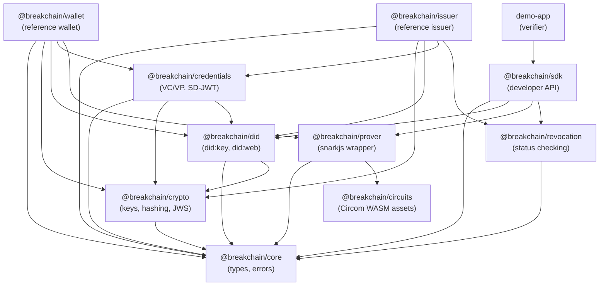

# Breakchain ZKP SDK — Phased Implementation Plan

## Goal

Build a standards-based ZKP credential SDK with reference issuer and wallet simulators. The system follows OpenID4VCI/OpenID4VP protocols, uses Circom+snarkjs for ZK proofs (WASM in-browser), supports SD-JWT and JSON-LD VCs, and exposes a simple developer API: `connectWallet()` → `requestProof()` → `verifyPresentation()`.

> [!IMPORTANT]
> This is a **TypeScript/Node.js monorepo** project. The reference issuer and wallet are simulators — the SDK is the real deliverable. The architecture is designed so that when real issuers/wallets exist, only config/endpoints change.

## Source Documents

- [Executive Summary](file:///c:/Users/ASUS/Documents/files/projects/sdk-zkp/docs/Executive%20Summary.md) — research survey of all open-source stacks
- [System Architecture](file:///c:/Users/ASUS/Documents/files/projects/sdk-zkp/docs/System%20Architecture.md) — high-level component diagram and module breakdown
- [Low-Level Architecture](file:///c:/Users/ASUS/Documents/files/projects/sdk-zkp/docs/ZKP%20Credential%20Ecosystem%20Low-Level%20Architecture.md) — detailed APIs, data models, crypto, protocol flows, code snippets

---

## Phase 1 — Project Scaffolding & Core Crypto Primitives

**Goal:** Set up the monorepo, configure tooling, and build the foundational crypto utilities that every other module depends on.

### 1.1 Monorepo Setup

#### [NEW] Root project configuration
- Initialize an **npm workspaces** monorepo (or pnpm/turborepo)
- Package structure (from [System Architecture L111-L141](file:///c:/Users/ASUS/Documents/files/projects/sdk-zkp/docs/System%20Architecture.md#L111-L141)):
  ```
  sdk-zkp/
    package.json              (workspace root)
    tsconfig.base.json        (shared TS config)
    packages/
      core/                   → @breakchain/core (shared types, errors, constants)
      crypto/                 → @breakchain/crypto (keys, hashing, signatures)
      did/                    → @breakchain/did (did:key + did:web resolvers)
      credentials/            → @breakchain/credentials (VC/VP parsing, SD-JWT)
      circuits/               → @breakchain/circuits (ZKP circuit assets + witness gen)
      prover/                 → @breakchain/prover (WASM snarkjs wrapper)
      wallet/                 → @breakchain/wallet (reference wallet)
      issuer/                 → @breakchain/issuer (reference issuer server)
      revocation/             → @breakchain/revocation (status list / revocation)
      sdk/                    → @breakchain/sdk (the developer-facing SDK)
      demo-app/               → demo web app (verifier)
    docs/                     (existing architecture docs)
  ```
- Configure: TypeScript 5.x, ESLint, Prettier, Vitest (unit testing), `tsup` or `unbuild` for bundling

#### [NEW] `packages/core/` — Shared Types & Constants
- TypeScript interfaces for all data models referenced in the low-level architecture:
  - `VerifiableCredential`, `VerifiablePresentation` (W3C VC Data Model v2)
  - `CredentialOffer`, `CredentialRequest`, `CredentialResponse` (OpenID4VCI)
  - `PresentationDefinition`, `InputDescriptor` (DIF Presentation Exchange)
  - `TokenResponse`, `AuthorizationRequest`
  - `DIDDocument`, `VerificationMethod`
  - `ProofResult`, `ZKProof` (`{ pi_a, pi_b, pi_c, publicSignals }`)
  - `StatusList2021Credential`
- Error classes: `WalletDeniedError`, `ProofGenerationError`, `InvalidProofError`, `RevocationError`, `CredentialNotFoundError`
- Constants: supported algorithms, DID methods, credential formats

### 1.2 Crypto Utilities

#### [NEW] `packages/crypto/` — Cryptographic Primitives
From [Low-Level Architecture L324-L354](file:///c:/Users/ASUS/Documents/files/projects/sdk-zkp/docs/ZKP%20Credential%20Ecosystem%20Low-Level%20Architecture.md#L324-L354):

- **Key generation**: Ed25519 keypair generation (using `@noble/ed25519` or `@stablelib/ed25519`)
- **Signing**: `sign(privateKey, data) → signature` and `verify(publicKey, data, signature) → boolean` for Ed25519
- **Hashing**: SHA-256 wrapper (for SD-JWT claim hashing), Poseidon hash (for ZK circuits — via `circomlibjs`)
- **JWK/JWS utilities**: Convert between JWK ↔ raw key bytes, create/verify JWS tokens (EdDSA)
- **Random salt generation**: For SD-JWT `_sd` entries
- **PKCE helpers**: `generateCodeVerifier()`, `generateCodeChallenge(verifier)` (S256)
- Unit tests for all crypto operations

### Deliverables
- Working monorepo with `npm install` and `npm run build` across all packages
- `@breakchain/core` with all shared types exported
- `@breakchain/crypto` with key generation, signing, hashing, JWS — all unit tested

---

## Phase 2 — DID Methods & Key Management

**Goal:** Implement `did:key` and `did:web` resolution, and a secure key store abstraction.

### 2.1 DID Resolvers

#### [NEW] `packages/did/` — DID Resolution
From [Executive Summary L14, L50-L57](file:///c:/Users/ASUS/Documents/files/projects/sdk-zkp/docs/Executive%20Summary.md#L14) and [Low-Level Architecture L423](file:///c:/Users/ASUS/Documents/files/projects/sdk-zkp/docs/ZKP%20Credential%20Ecosystem%20Low-Level%20Architecture.md#L423):

- **`did:key` resolver**:
  - `generateDidKey(publicKey: Uint8Array) → string` — encode Ed25519 public key as multibase `did:key:z6Mk...`
  - `resolveDidKey(did: string) → DIDDocument` — parse the DID, extract the public key, return a DID Document with `verificationMethod` and `authentication`
  - No network calls needed — fully self-contained
  
- **`did:web` resolver**:
  - `resolveDidWeb(did: string) → DIDDocument` — transform `did:web:example.com` to `https://example.com/.well-known/did.json`, fetch via HTTPS, parse and return
  - Handle subpaths: `did:web:example.com:path:to` → `https://example.com/path/to/did.json`
  
- **Unified resolver interface**:
  ```typescript
  interface DIDResolver {
    resolve(did: string): Promise<DIDDocument>;
    extractPublicKey(didDoc: DIDDocument): Promise<Uint8Array>;
  }
  ```

### 2.2 Key Store Abstraction

#### [NEW] `packages/crypto/src/key-store.ts` — Secure Key Store
From [Low-Level Architecture L321-L355](file:///c:/Users/ASUS/Documents/files/projects/sdk-zkp/docs/ZKP%20Credential%20Ecosystem%20Low-Level%20Architecture.md#L321-L355):

- `KeyStore` interface:
  ```typescript
  interface KeyStore {
    generateKeyPair(algorithm: 'Ed25519'): Promise<{ did: string; publicKey: Uint8Array }>;
    sign(did: string, data: Uint8Array): Promise<Uint8Array>;
    getPublicKey(did: string): Promise<Uint8Array | null>;
    listKeys(): Promise<string[]>;
    deleteKey(did: string): Promise<void>;
  }
  ```
- **InMemoryKeyStore** — for testing and demo mode (stores keys in a Map)
- **BrowserKeyStore** — wraps `crypto.subtle` with `IndexedDB` for persistence (non-extractable CryptoKeys)
- Private keys never exposed outside the KeyStore

### Deliverables
- `@breakchain/did` with both resolvers, unit tested with sample DIDs
- `KeyStore` abstraction with in-memory and browser implementations
- Integration test: generate a `did:key`, resolve it, verify the public key matches

---

## Phase 3 — Credential Models & SD-JWT

**Goal:** Build the credential processing layer — parsing, creating, and selectively disclosing VCs using both JSON-LD and SD-JWT formats.

### 3.1 Verifiable Credential Processing

#### [NEW] `packages/credentials/` — VC/VP Engine
From [Low-Level Architecture L42-L86](file:///c:/Users/ASUS/Documents/files/projects/sdk-zkp/docs/ZKP%20Credential%20Ecosystem%20Low-Level%20Architecture.md#L42-L86) and [Executive Summary L12](file:///c:/Users/ASUS/Documents/files/projects/sdk-zkp/docs/Executive%20Summary.md#L12):

- **VC Builder**:
  - `createVerifiableCredential(issuerDid, subjectDid, claims, schema) → UnsignedVC`
  - `signCredential(vc: UnsignedVC, signerKey, algorithm) → VerifiableCredential` (adds `proof` object with JWS)
  - `verifyCredential(vc: VerifiableCredential, resolverFn) → { valid: boolean, errors: string[] }`
  
- **VP Builder**:
  - `createVerifiablePresentation(credentials: VC[], holderDid, challenge) → UnsignedVP`
  - `signPresentation(vp, holderKey) → VerifiablePresentation`
  - `verifyPresentation(vp, resolverFn) → { valid: boolean, issuerVerified: boolean, holderVerified: boolean }`

### 3.2 SD-JWT Implementation

From [Executive Summary L12, L344-L355](file:///c:/Users/ASUS/Documents/files/projects/sdk-zkp/docs/Executive%20Summary.md#L12) and [Low-Level Architecture L66-L86](file:///c:/Users/ASUS/Documents/files/projects/sdk-zkp/docs/ZKP%20Credential%20Ecosystem%20Low-Level%20Architecture.md#L66-L86):

- **SD-JWT Issuer**:
  - `issueSDJWT(claims, disclosureFrame: string[], signerKey) → string` — creates an SD-JWT with `_sd` hashed entries for each field in disclosureFrame
  - Each hidden claim → `SHA-256(salt + claim_name + claim_value)` stored in `_sd` array
  
- **SD-JWT Presenter**:
  - `presentSDJWT(sdJwtToken, revealFields: string[]) → string` — creates a presentation disclosing only specified fields
  
- **SD-JWT Verifier**:
  - `verifySDJWT(presentation, issuerPublicKey) → { valid: boolean, disclosed: Record<string, any> }`
  - Checks JWS signature, then verifies `_sd` hash digests match revealed claims

### Deliverables
- `@breakchain/credentials` with VC/VP creation, signing, verification
- SD-JWT issue → present → verify flow working end-to-end
- Unit tests with sample W3C VC JSON-LD and SD-JWT payloads (using the JSON samples from the architecture docs)

---

## Phase 4 — Reference Issuer Server

**Goal:** Build the OpenID4VCI-compliant issuer server that authenticates holders, issues signed VCs, and serves metadata.

#### [NEW] `packages/issuer/` — Reference Issuer
From [Low-Level Architecture L5-L124](file:///c:/Users/ASUS/Documents/files/projects/sdk-zkp/docs/ZKP%20Credential%20Ecosystem%20Low-Level%20Architecture.md#L5-L124) and [System Architecture L58-L66](file:///c:/Users/ASUS/Documents/files/projects/sdk-zkp/docs/System%20Architecture.md#L58-L66):

### 4.1 Issuer Metadata & Discovery
- `GET /.well-known/openid-credential-issuer` → returns issuer metadata JSON (supported credential types, formats, endpoints)
- `GET /.well-known/oauth-authorization-server` → returns OAuth server metadata (token endpoint, supported grant types)
- Configurable credential schemas (e.g. `IDCard`, `DriverLicense`, `Diploma`)

### 4.2 OAuth / Token Flow
- **Pre-Authorized Code flow** (simpler, for demo):
  - `POST /api/credential-offer` → creates a credential offer with `pre-authorized_code`
  - `POST /api/token` → exchanges pre-auth code for `{ access_token, c_nonce }`
- **Authorization Code flow** (optional, for full compliance):
  - `GET /authorize` → login page (simple form for demo)
  - `POST /token` → exchanges auth code + PKCE for access token

### 4.3 Credential Issuance
- `POST /api/credential` — the core endpoint:
  1. Validate bearer token
  2. Validate holder's proof-of-possession (JWS over `c_nonce` using holder's key)
  3. Build VC from configured claims + holder DID
  4. Sign VC with issuer's Ed25519 key
  5. Return `{ format, credential, c_nonce }`
- Supports both `ldp_vc` (JSON-LD) and `sd-jwt` formats
- Stores issued credential metadata in SQLite (for revocation tracking)

### 4.4 Issuer Key Management
- Issuer generates an Ed25519 keypair on startup (or loads from env)
- Publishes DID Document at `/.well-known/did.json` (did:web)
- Signs all credentials with this key

### Tech Stack
- **Express.js** server
- **SQLite** (via `better-sqlite3`) for credential metadata
- Uses `@breakchain/crypto` for signing, `@breakchain/credentials` for VC creation, `@breakchain/did` for DID handling

### Deliverables
- Running issuer at `http://localhost:3001`
- Full pre-auth code issuance flow testable via curl/Postman
- Credential offer → token exchange → credential issuance working end-to-end
- Unit + integration tests

---

## Phase 5 — ZKP Circuits & WASM Prover

**Goal:** Build ZK circuits (Circom), compile to WASM, and create a JavaScript prover wrapper that runs in Node.js and browser.

> [!IMPORTANT]
> This is the most technically complex phase. Circom + snarkjs is chosen over Noir for Phase 1 due to its larger ecosystem and simpler JS integration. Noir can be added later as an alternative backend.

### 5.1 ZKP Circuits

#### [NEW] `packages/circuits/` — Circuit Definitions
From [Executive Summary L8, L321-L331](file:///c:/Users/ASUS/Documents/files/projects/sdk-zkp/docs/Executive%20Summary.md#L8) and [System Architecture L125-L128](file:///c:/Users/ASUS/Documents/files/projects/sdk-zkp/docs/System%20Architecture.md#L125-L128):

- **Circuit: `ageOver`** — proves `age >= threshold` without revealing the actual age
  ```circom
  template AgeOver(threshold) {
      signal input age;
      signal input ageHash;       // Poseidon(age, salt)
      signal input salt;
      signal output valid;
      // Verify hash commitment
      component hasher = Poseidon(2);
      hasher.inputs[0] <== age;
      hasher.inputs[1] <== salt;
      ageHash === hasher.out;
      // Range check
      signal diff;
      diff <== age - threshold;
      valid <== 1;  // constrained by diff >= 0
  }
  ```
- **Circuit: `nationalityCheck`** — proves citizenship matches a value without revealing other fields
- **Circuit: `credentialOwnership`** — proves holder owns a credential bound to their DID (Poseidon hash of DID + credential hash)
- **Build script**: `circom compile` → generates `.r1cs`, `.wasm`, `.sym` for each circuit
- **Trusted setup script**: Runs Powers-of-Tau ceremony + Groth16 setup → produces `.zkey` and `verification_key.json`
- Pre-built artifacts committed to the repo (WASM + keys) so consumers don't need circom installed

### 5.2 Prover Wrapper

#### [NEW] `packages/prover/` — snarkjs WASM Prover
From [Executive Summary L324-L331](file:///c:/Users/ASUS/Documents/files/projects/sdk-zkp/docs/Executive%20Summary.md#L324-L331) and [Low-Level Architecture L253-L258](file:///c:/Users/ASUS/Documents/files/projects/sdk-zkp/docs/ZKP%20Credential%20Ecosystem%20Low-Level%20Architecture.md#L253-L258):

- **`ZKProver` class**:
  ```typescript
  class ZKProver {
    constructor(circuitWasm: Uint8Array, zkeyData: Uint8Array);
    async generateProof(inputs: Record<string, bigint>): Promise<{
      proof: { pi_a: string[]; pi_b: string[][]; pi_c: string[] };
      publicSignals: string[];
    }>;
  }
  ```
- **`ZKVerifier` class**:
  ```typescript
  class ZKVerifier {
    constructor(verificationKey: object);
    async verify(proof: ZKProof, publicSignals: string[]): Promise<boolean>;
  }
  ```
- **`CircuitSelector`** — maps claim requests (e.g. `{ field: 'age', condition: '>=18' }`) to the correct circuit + input mapping
- **`WitnessGenerator`** — converts credential claims into circuit input signals (hashing with Poseidon, encoding fields)
- Wraps `snarkjs` library for both Node.js and browser (WASM)
- Browser: use WebWorker for proof generation to avoid blocking UI

### Deliverables
- Compiled circuit artifacts (`.wasm`, `.zkey`, `verification_key.json`) for age-over and nationality circuits
- `@breakchain/prover` that can generate and verify Groth16 proofs in Node.js
- End-to-end test: create a proof that `age >= 18` with private input `age = 25`, verify it passes; `age = 16` fails
- Build scripts documented in README

---

## Phase 6 — Reference Wallet

**Goal:** Build the holder wallet that stores credentials, manages keys, generates ZK proofs, and responds to presentation requests.

#### [NEW] `packages/wallet/` — Reference Wallet
From [Low-Level Architecture L126-L205](file:///c:/Users/ASUS/Documents/files/projects/sdk-zkp/docs/ZKP%20Credential%20Ecosystem%20Low-Level%20Architecture.md#L126-L205) and [System Architecture L48-L57](file:///c:/Users/ASUS/Documents/files/projects/sdk-zkp/docs/System%20Architecture.md#L48-L57):

### 6.1 Wallet Core
- **`WalletCore` class**:
  ```typescript
  class WalletCore {
    constructor(keyStore: KeyStore);
    // Identity
    async initialize(): Promise<string>;  // generates DID, returns did:key
    getDid(): string;
    // Credential management
    async addCredential(vc: VerifiableCredential): Promise<void>;
    async getCredentials(): Promise<VerifiableCredential[]>;
    async findCredentials(filter: InputDescriptor[]): Promise<VerifiableCredential[]>;
    // Presentation
    async createPresentation(
      credentials: VerifiableCredential[],
      presentationDef: PresentationDefinition,
      challenge: string
    ): Promise<VerifiablePresentation>;
  }
  ```
- **Credential storage**: In-memory store for demo, with `IndexedDB` adapter for browser persistence
- **Credential verification on import**: When `addCredential()` is called, verify the issuer's signature before storing

### 6.2 Issuance Client
- **`IssuanceClient`** — implements the wallet side of OpenID4VCI:
  1. Parse credential offer (QR code URL or JSON)
  2. Fetch issuer metadata (`/.well-known/openid-credential-issuer`)
  3. Exchange pre-auth code for access token (`POST /token`)
  4. Create proof-of-possession (JWS with holder key over `c_nonce`)
  5. Request credential (`POST /credential`)
  6. Store received VC in wallet

### 6.3 Presentation + ZK Proof Engine
- **`PresentationEngine`**:
  1. Receive presentation definition (which claims are needed, with conditions)
  2. Find matching credential(s) in storage
  3. If ZKP mode: extract private inputs from credential, select circuit, generate ZK proof via `@breakchain/prover`
  4. If SD-JWT mode: create selective disclosure presentation
  5. If plain VP mode: create and sign a VP with holder key
  6. Return `{ vp_token, proof_type }`

### 6.4 Wallet HTTP Server (Simulator)
- Express server at `http://localhost:3002`
- `POST /api/presentation-request` — receives a presentation definition, triggers the engine, returns VP
- `GET /api/credentials` — lists stored credentials (for UI/debug)
- `POST /api/receive-offer` — accepts a credential offer URL, runs the issuance client flow

### Deliverables
- Working wallet server that can:
  - Accept a credential offer from the issuer and store the VC
  - Receive a presentation request and return a VP with a ZK proof
- Integration test: Issuer issues a credential → Wallet stores it → Wallet presents a ZK proof of a claim

---

## Phase 7 — Breakchain SDK (Developer-Facing API)

**Goal:** Build the main SDK package — the product that web developers integrate. It abstracts wallet connection, proof requests, and verification into 3 method calls.

#### [NEW] `packages/sdk/` — Breakchain SDK
From [Low-Level Architecture L207-L287](file:///c:/Users/ASUS/Documents/files/projects/sdk-zkp/docs/ZKP%20Credential%20Ecosystem%20Low-Level%20Architecture.md#L207-L287) and [System Architecture L29-L47](file:///c:/Users/ASUS/Documents/files/projects/sdk-zkp/docs/System%20Architecture.md#L29-L47):

### 7.1 SDK Core API

```typescript
class BreakchainSDK {
  constructor(config: SDKConfig);

  /** Connect to a wallet (reference wallet or future real wallet) */
  async connectWallet(): Promise<void>;

  /** Request a ZK proof for specific claims */
  async requestProof(options: {
    claims: ClaimRequest[];   // e.g. [{ field: 'age', condition: '>=18' }]
    circuit?: string;          // optional named circuit override
    mode?: 'zkp' | 'sd-jwt' | 'plain';
  }): Promise<ProofResult>;

  /** Verify a received presentation (ZK proof + VC signatures + revocation) */
  async verifyPresentation(vp: VerifiablePresentation): Promise<VerificationResult>;

  /** Disconnect wallet session */
  async disconnect(): Promise<void>;
}
```

### 7.2 Internal Modules

- **`WalletConnector`** — manages HTTP/WebSocket/postMessage connection to wallet
  - For reference wallet: direct HTTP calls to `localhost:3002`
  - For future wallets: OIDC4VP redirect flow or browser extension messaging
  - Adapter pattern: `WalletAdapter` interface with `HttpWalletAdapter`, `BrowserExtensionAdapter`

- **`PresentationRequestBuilder`** — converts developer's `ClaimRequest[]` into a DIF `PresentationDefinition` JSON
  - Maps field names + conditions to `input_descriptors` with `constraints.fields`

- **`ProofOrchestrator`** — coordinates the full flow:
  1. Build presentation definition
  2. Send to wallet via adapter
  3. Receive VP response
  4. Verify the proof (ZK + signatures + revocation)
  5. Extract revealed claims
  6. Return `ProofResult`

- **`VerificationEngine`** — verifies all layers:
  1. Verify holder's VP signature (using DID resolver)
  2. Verify issuer's VC signature (using DID resolver)
  3. Verify ZK proof (using `@breakchain/prover`'s `ZKVerifier`)
  4. Check revocation status (via `@breakchain/revocation`)
  5. Validate presentation against the original request

### 7.3 SDK Bundle
- Build as ESM + CJS for Node.js
- Build as UMD/ESM bundle for browser (with embedded WASM verifier)
- Tree-shakeable exports

### Deliverables
- `@breakchain/sdk` npm package with the 3-method API
- Works in both Node.js and browser environments
- Full integration test: SDK → Wallet → Issuer round-trip
- JSDoc + generated API reference

---

## Phase 8 — Revocation Registry

**Goal:** Implement credential revocation so verifiers can check if a credential is still valid.

#### [NEW] `packages/revocation/` — Revocation Service
From [Low-Level Architecture L357-L416](file:///c:/Users/ASUS/Documents/files/projects/sdk-zkp/docs/ZKP%20Credential%20Ecosystem%20Low-Level%20Architecture.md#L357-L416) and [System Architecture L73-L79](file:///c:/Users/ASUS/Documents/files/projects/sdk-zkp/docs/System%20Architecture.md#L73-L79):

### 8.1 Simple Lookup API (Demo Mode)
- Backed by the issuer's SQLite database
- Endpoints added to the issuer server:
  - `GET /api/status?id=<credentialId>` → `{ "revoked": false }`
  - `POST /api/revoke` (issuer-authenticated) → marks credential as revoked

### 8.2 StatusList2021 (Standards Mode)
- Generate a `StatusList2021Credential` — a signed VC containing a compressed bitstring
- Each issued credential gets an index in the bitstring
- `GET /api/status-list` → returns the signed StatusList2021 VC
- Verifier fetches the list, checks the bit at the credential's index

### 8.3 SDK Integration
- `RevocationClient` in the SDK calls the issuer's status endpoint during `verifyPresentation()`
- Configurable: skip revocation check for offline/demo scenarios

### Deliverables
- Revocation endpoints on the issuer server
- SDK's `verifyPresentation()` checks revocation before returning valid
- Test: issue → verify (passes) → revoke → verify again (fails)

---

## Phase 9 — Demo Web App & End-to-End Flow

**Goal:** Build a polished demo application that showcases the full ecosystem and proves everything works together.

#### [NEW] `packages/demo-app/` — Verifier Demo App
From [Low-Level Architecture L289-L319](file:///c:/Users/ASUS/Documents/files/projects/sdk-zkp/docs/ZKP%20Credential%20Ecosystem%20Low-Level%20Architecture.md#L289-L319) and [Low-Level Architecture L486-L561](file:///c:/Users/ASUS/Documents/files/projects/sdk-zkp/docs/ZKP%20Credential%20Ecosystem%20Low-Level%20Architecture.md#L486-L561):

### 9.1 Demo Verifier Web App
- **Next.js** or **Vite + React** app
- Pages:
  - **Home** — explains the system, shows architecture diagram
  - **Issue Credential** — form to get a demo credential from the reference issuer (triggers issuer → wallet flow)
  - **Verify with ZKP** — "Login with ZKP" button that calls `sdk.requestProof()`, displays result
  - **Admin / Revoke** — issuer admin panel to revoke credentials
- Integrates `@breakchain/sdk` on the frontend (React component wrapping the SDK)
- Backend API route for server-side verification (`/api/verify`)

### 9.2 Full End-to-End Flow
The demo must demonstrate all four flows from [System Architecture L80-L109](file:///c:/Users/ASUS/Documents/files/projects/sdk-zkp/docs/System%20Architecture.md#L80-L109):

1. **Issuance**: User clicks "Get Credential" → Issuer creates offer → Wallet receives + stores VC
2. **Proof Request**: User clicks "Login with ZKP" → SDK builds presentation request → Wallet selects credential
3. **ZK Proof Generation**: Wallet loads circuit WASM → computes witness → generates Groth16 proof → returns VP
4. **Verification**: SDK verifies ZK proof + issuer signature + revocation → grants access

### 9.3 Launch Scripts
- `npm run demo` — starts all three servers (issuer:3001, wallet:3002, demo-app:3000) concurrently
- `npm run demo:setup` — runs trusted setup, compiles circuits, seeds demo credentials

### Deliverables
- Fully working demo that can be started with a single command
- Visual proof of all four flows working
- README with step-by-step demo walkthrough

---

## Phase 10 — Hardening, Docs & Publishing

**Goal:** Security review, performance optimization, comprehensive documentation, and npm publishing.

### 10.1 Security Hardening
- Nonce (`c_nonce`) validation on all token exchanges
- PKCE enforcement on authorization code flow
- Input validation on all API endpoints (Zod schemas)
- Ensure private keys are never serialized or logged
- HTTPS enforcement guidance in production docs
- Rate limiting on issuer/wallet endpoints

### 10.2 Performance
- WebWorker wrapper for browser-side proof generation (non-blocking UI)
- Lazy-load circuit WASM assets (only load needed circuit)
- Benchmark proof generation times for each circuit and document them

### 10.3 Documentation
- **README.md** — project overview, quick start, architecture diagram
- **API Reference** — auto-generated from JSDoc/TSDoc (TypeDoc)
- **Integration Guide** — how web developers use `@breakchain/sdk` in their apps
- **Circuit Guide** — how to write custom circuits and register them
- **Security Model** — trust boundaries, threat model, key management

### 10.4 npm Publishing
- Publish all packages to npm under `@breakchain/` scope
- Semantic versioning
- CI/CD pipeline (GitHub Actions): lint → test → build → publish

### Deliverables
- All packages published to npm
- Comprehensive documentation site or README
- CI/CD pipeline running

---

## Dependency Graph



## Phase Summary & Estimated Effort

| Phase | Name | Key Packages | Est. Effort |
|-------|------|-------------|-------------|
| 1 | Scaffolding + Crypto | `core`, `crypto` | 3-4 days |
| 2 | DID + Key Management | `did`, `crypto/key-store` | 2-3 days |
| 3 | Credentials + SD-JWT | `credentials` | 3-4 days |
| 4 | Reference Issuer | `issuer` | 4-5 days |
| 5 | ZKP Circuits + Prover | `circuits`, `prover` | 5-7 days |
| 6 | Reference Wallet | `wallet` | 5-6 days |
| 7 | Breakchain SDK | `sdk` | 4-5 days |
| 8 | Revocation | `revocation` | 2-3 days |
| 9 | Demo App + E2E | `demo-app` | 3-4 days |
| 10 | Hardening + Docs | all | 3-4 days |
| | **Total** | | **~35-45 days** |

## Open Questions

> [!IMPORTANT]
> **1. Circom installation requirement:** Circom is a Rust binary that must be installed separately to compile circuits. Should we:
> - (a) Pre-compile all circuit artifacts and commit them to the repo (consumers never need Circom), or
> - (b) Require Circom as a dev dependency and compile during build?
>
> **Recommendation:** Option (a) — commit pre-built `.wasm` + `.zkey` + `verification_key.json` files. Only circuit developers need Circom.

> [!IMPORTANT]
> **2. Wallet communication protocol:** For the demo, the SDK communicates with the wallet via direct HTTP. For production, what protocol should be used?
> - (a) HTTP REST (current plan for demo)
> - (b) postMessage (for browser extension wallets)
> - (c) Deep links / custom URL schemes (for mobile wallets)
> - (d) All of the above via adapter pattern
>
> **Recommendation:** Option (d) — implement the adapter pattern now, but only build the HTTP adapter in Phase 6. Add browser/mobile adapters later.

> [!IMPORTANT]
> **3. Noir/Barretenberg as alternative backend:** The architecture docs describe both Circom+snarkjs and Noir+Barretenberg. Should Noir be:
> - (a) Deferred entirely to a future version
> - (b) Added as an alternative prover backend in Phase 5
>
> **Recommendation:** Option (a) — ship with Circom+snarkjs first. Noir can be added later as a second `ProverBackend` implementation.

> [!WARNING]
> **4. Trusted Setup Ceremony:** Groth16 requires a Powers-of-Tau trusted setup. For a demo/prototype, a single-party "unsafe" setup is fine. For production, a multi-party ceremony would be needed. Is this acceptable for now?
