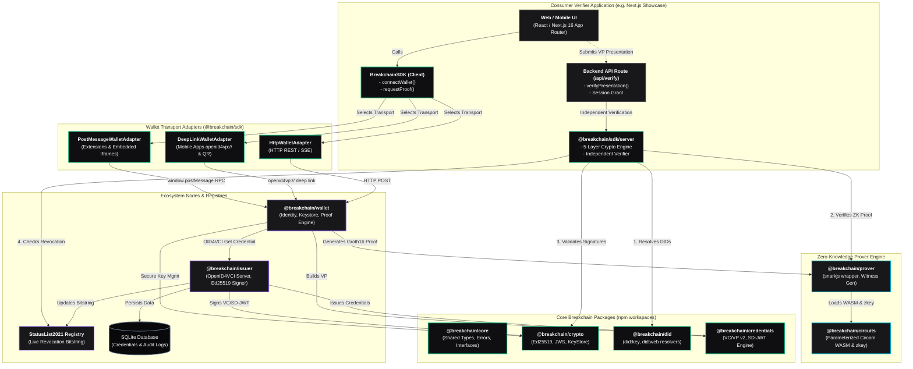

# SDK Architecture (Fully Built State)

This document details the **production architecture** of the Breakchain ZKP Ecosystem. It encompasses the client-side developer SDK, the server-side verification engine, the multi-transport wallet adapters, the reference backend simulators (Issuer & Wallet), and the parameterized Groth16 ZKP proving mechanics.

---

## Architectural Highlights

### 1. Dual-Sided Verification Architecture
* **Client-Side (`@breakchain/sdk`)**: Integrates into the frontend to handle wallet connection, user consent, and proof requests across 3 transport mechanisms (`PostMessage`, `DeepLink`, and `HTTP`).
* **Server-Side (`@breakchain/sdk/server`)**: Enforces cryptographic integrity on backend API routes (e.g. Next.js Route Handlers) to verify presentations independently without trusting the client browser.

### 2. The 5-Layer Cryptographic Pipeline
The server verification engine evaluates every presentation across 5 distinct security layers:
1. **Schema Check**: Validates that the presented credential contains the requested attribute.
2. **Issuer Authority Signature**: Verifies the `Ed25519Signature2020` / JWS digital signature of the issuer's DID.
3. **Condition Proof**: Evaluates the Groth16 mathematical zero-knowledge proof or SD-JWT disclosure against the threshold.
4. **Holder Key Binding**: Verifies that the presenter signed a server nonce challenge using the private key matching the credential's `holderDid` (prevents stolen token attacks).
5. **Real-Time Revocation**: Queries the issuer's live StatusList2021 registry for active status.

### 3. Parameterized Groth16 Circuits
Circuits in `@breakchain/circuits` accept dynamic parameters (e.g., `ageThreshold` in `age_over.circom`). This eliminates the need for hardcoded limits and allows a single compiled circuit artifact to verify arbitrary thresholds (`18+`, `21+`, `65+`, etc.).

### 4. Reference Full-Stack Showcase
Demonstrated in `breakchain-showcase` (Next.js 16 App Router / React 19):
* Real-world implementations of 3 consumer applications:
  * **Viper Esports 21+ VIP Tournament** (`age >= 21` via Groth16 ZKP)
  * **National Citizen Service Portal** (`nationality == 356 IND` via ZKP)
  * **TechCareers Engineering Gateway** (`degree == 'B.Tech'` via SD-JWT)
* Dynamic 3-tier credential categorization:
  * ✅ *Has Criteria & Meets Condition*
  * ❌ *Has Criteria & Fails Condition*
  * ⚠️ *Missing Criteria (Incompatible Schema)*
