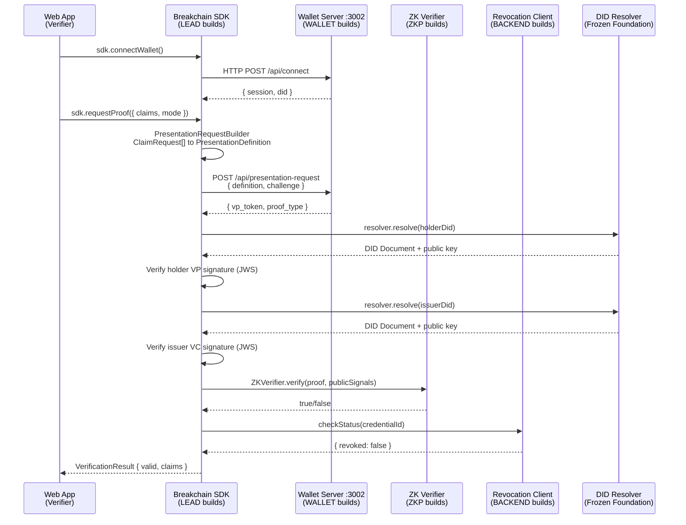
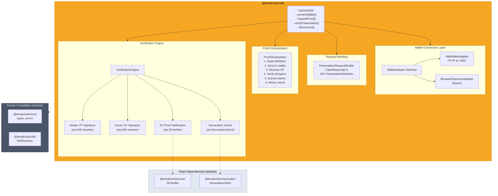
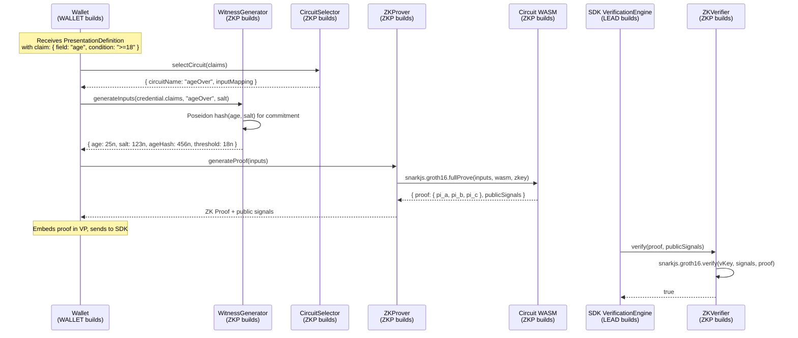
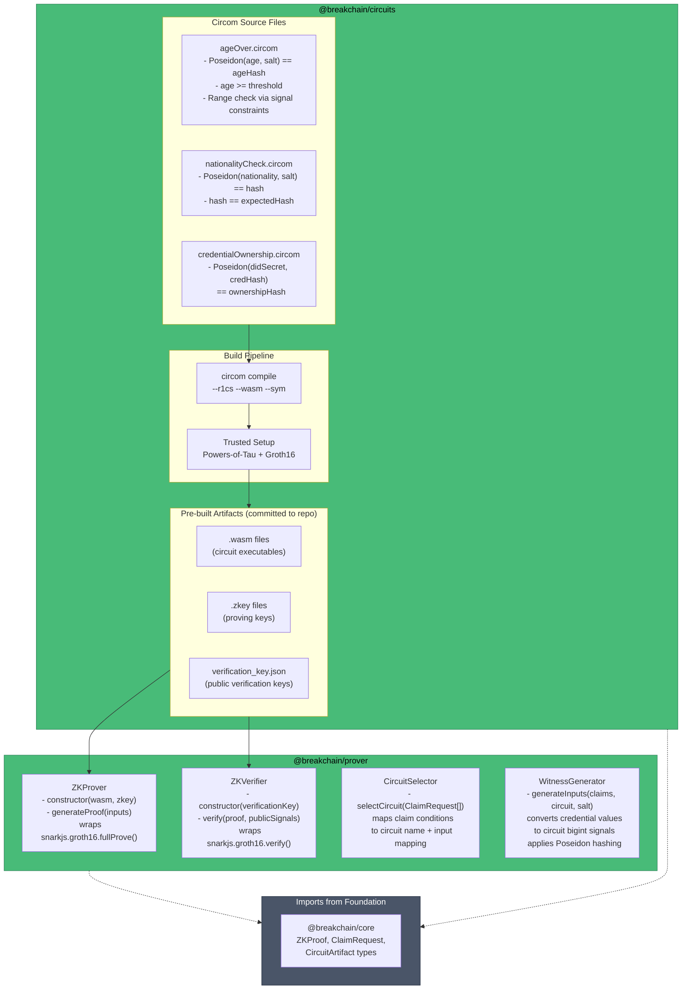
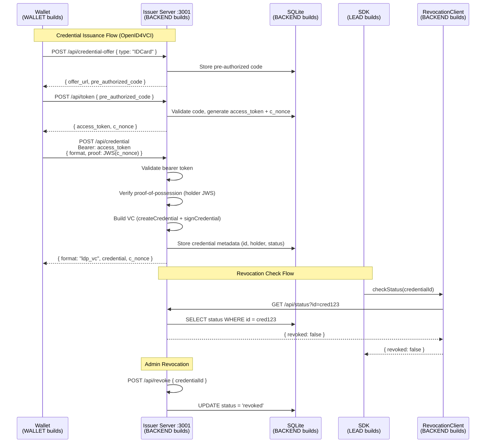
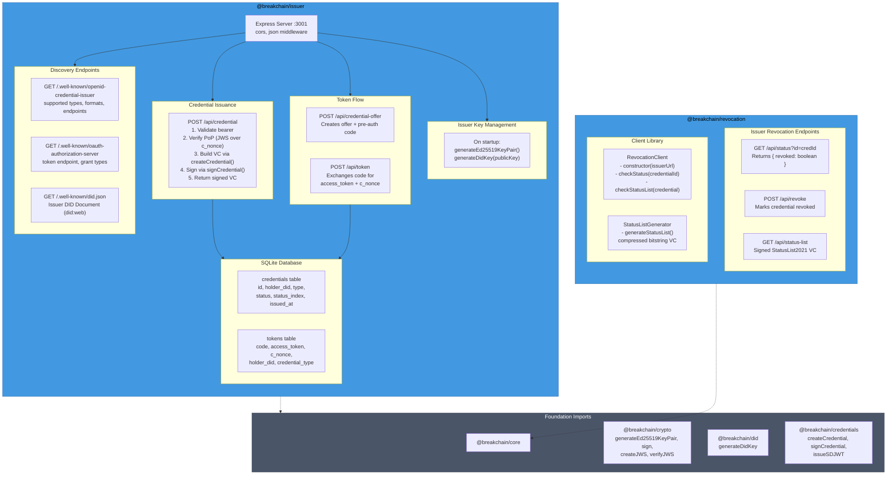
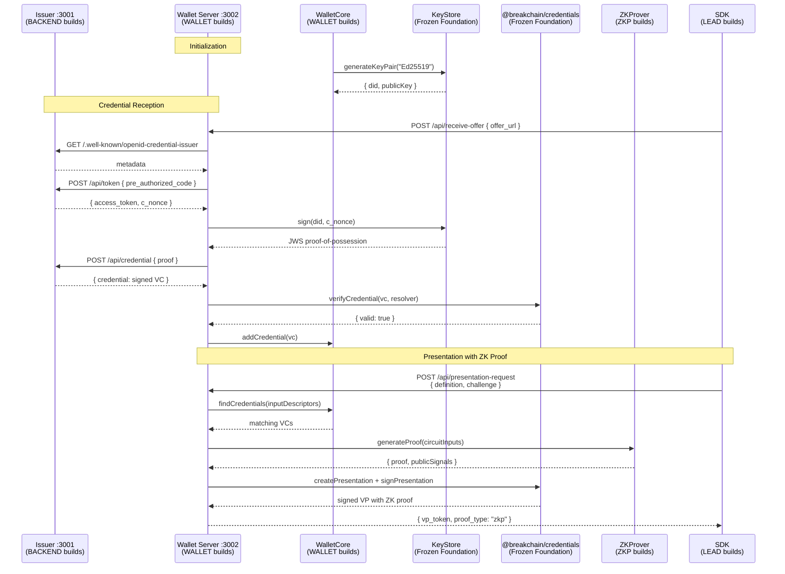
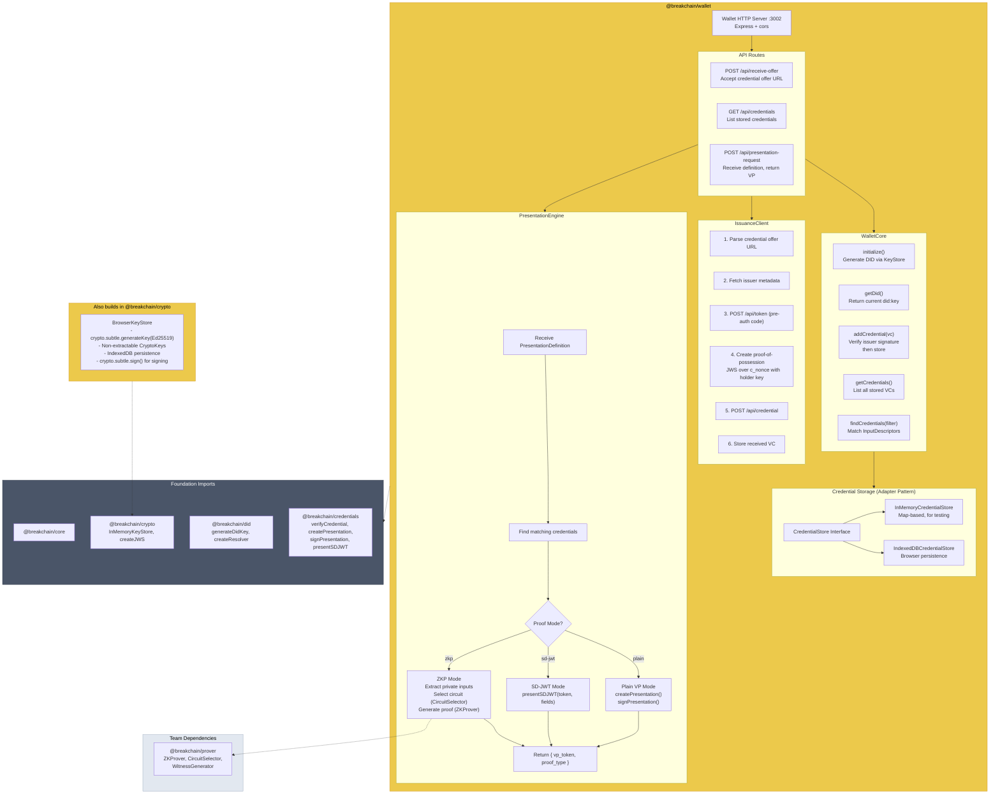
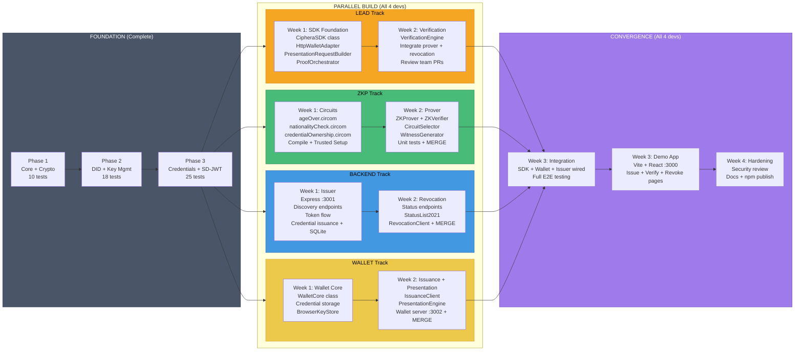

# Team Role Diagrams

All diagrams are based on [System Architecture](file:///c:/Users/ASUS/Documents/files/projects/sdk-zkp/docs/System%20Architecture.md), [Low-Level Architecture](file:///c:/Users/ASUS/Documents/files/projects/sdk-zkp/docs/ZKP%20Credential%20Ecosystem%20Low-Level%20Architecture.md), and [Implementation Plan](file:///c:/Users/ASUS/Documents/files/projects/sdk-zkp/docs/implementation_plan.md).

---

## Diagram 1 - Lead: Interaction Flow with Other Roles

How the SDK connects to every other component in the system.

---

## Diagram 2 - Lead: What You Build (SDK Internals)

---

## Diagram 3 - ZKP Engineer: Interaction Flow with Other Roles

How the circuits and prover connect into the ecosystem.

---

## Diagram 4 - ZKP Engineer: What You Build (Circuits + Prover Internals)

---

## Diagram 5 - Backend Engineer: Interaction Flow with Other Roles

The issuer's OpenID4VCI flow and revocation checks.

---

## Diagram 6 - Backend Engineer: What You Build (Issuer + Revocation Internals)

---

## Diagram 7 - Wallet Engineer: Interaction Flow with Other Roles

The wallet's full lifecycle - receiving credentials and presenting proofs.

---

## Diagram 8 - Wallet Engineer: What You Build (Wallet Internals)

---

## Diagram 9 - Full Team Timeline

