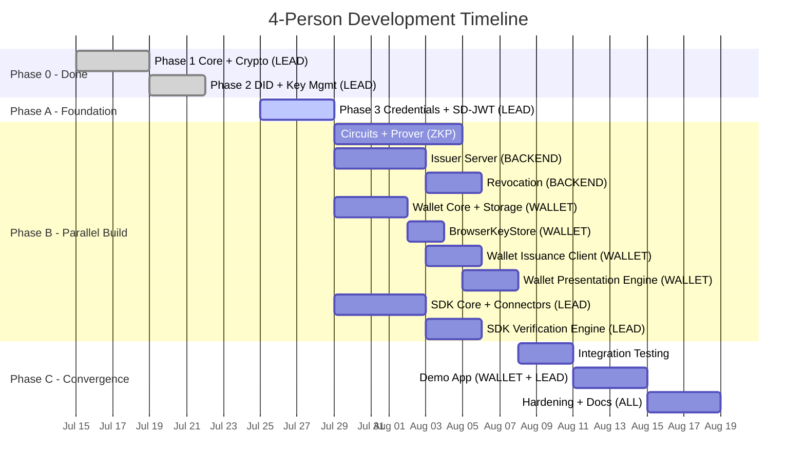
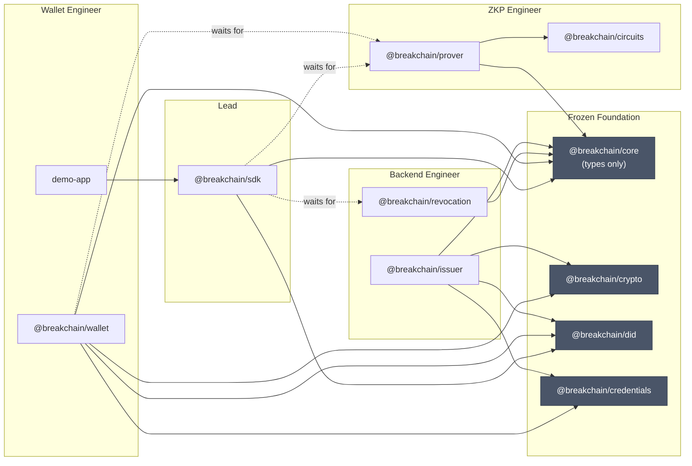

# Breakchain ZKP SDK — 4-Person Team Work Division

## Team Roles

| Role | Code Name | Primary Phases | Packages Owned |
|---|---|---|---|
| **Lead / Architect** (You) | `LEAD` | 3 → 7 → 9 → 10 | `core`, `crypto`, `did`, `credentials`, `sdk` |
| **ZKP Engineer** | `ZKP` | 5 | `circuits`, `prover` |
| **Backend Engineer** | `BACKEND` | 4 → 8 | `issuer`, `revocation` |
| **Wallet / Fullstack Engineer** | `WALLET` | 6 → 9 | `wallet`, `demo-app` |

> [!IMPORTANT]
> **Golden rule:** Each person owns their packages exclusively. You never push code into another person's `packages/` folder. If you need something from another package, you request it via a type/interface in `@breakchain/core`.

---

## Timeline Overview



---

## Phase A — Foundation (You Solo)

**Duration:** ~4 days | **Status:** Starting now

You complete **Phase 3 (Credentials + SD-JWT)** alone. This is the last sequential piece.

After this, you **freeze** the following packages — no structural changes without team discussion:
- `@breakchain/core` (types, errors, constants)
- `@breakchain/crypto` (keys, hashing, JWS, KeyStore)
- `@breakchain/did` (resolvers)
- `@breakchain/credentials` (VC/VP, SD-JWT)

### What "freeze" means
- The **public API** (exported functions, types, interfaces) does not change
- Bug fixes are fine
- Adding new exports is fine (backwards compatible)
- Renaming/removing/changing signatures → **requires team notification + PR review**

---

## Phase B — Parallel Build (All 4 Developers)

Starts the day after Phase 3 is complete. Everyone works simultaneously.

---

### 🟢 ZKP Engineer — Circuits & Prover

**Packages:** `packages/circuits/`, `packages/prover/`

**Skills needed:** Circom, ZK math, snarkjs, WASM

#### Week 1: Circuits (Phase 5.1)

| Task | Details |
|---|---|
| Set up Circom toolchain | Install Circom compiler (Rust), configure build scripts |
| `ageOver` circuit | Poseidon hash commitment + range check (`age >= threshold`) |
| `nationalityCheck` circuit | Poseidon hash match for citizenship field |
| `credentialOwnership` circuit | Proves holder DID is bound to credential via hash |
| Compile all circuits | Generate `.r1cs`, `.wasm`, `.sym` for each |
| Trusted setup (dev) | Powers-of-Tau ceremony → `.zkey` + `verification_key.json` |
| Commit pre-built artifacts | `.wasm`, `.zkey`, `verification_key.json` in `circuits/artifacts/` |

#### Week 2: Prover (Phase 5.2)

| Task | Details |
|---|---|
| `ZKProver` class | Wraps `snarkjs.groth16.fullProve()` — takes circuit WASM + zkey + inputs |
| `ZKVerifier` class | Wraps `snarkjs.groth16.verify()` — takes verification key + proof + signals |
| `CircuitSelector` | Maps `ClaimRequest` → correct circuit name + input mapping |
| `WitnessGenerator` | Converts credential claim values → circuit input signals (Poseidon encoding) |
| Unit tests | age ≥ 18 with age=25 ✅, age=16 ❌. Nationality match/mismatch |
| Browser WebWorker wrapper | Optional: non-blocking proof gen for browser use |

#### Files they own

```
packages/circuits/
├── package.json
├── tsconfig.json
├── circom/                    ← circuit source files
│   ├── ageOver.circom
│   ├── nationalityCheck.circom
│   └── credentialOwnership.circom
├── artifacts/                 ← pre-built outputs
│   ├── ageOver/
│   │   ├── ageOver.wasm
│   │   ├── ageOver.zkey
│   │   └── verification_key.json
│   ├── nationalityCheck/
│   └── credentialOwnership/
├── scripts/
│   ├── compile.sh             ← circom compile script
│   └── setup.sh               ← trusted setup script
└── src/
    └── index.ts               ← exports artifact paths/loaders

packages/prover/
├── package.json
├── tsconfig.json
└── src/
    ├── index.ts
    ├── prover.ts              ← ZKProver class
    ├── verifier.ts            ← ZKVerifier class
    ├── circuit-selector.ts
    ├── witness-generator.ts
    └── __tests__/
        └── prover.test.ts
```

#### What they import (read-only)

```typescript
// From @breakchain/core — types only
import { ZKProof, ProverBackend, CircuitArtifact, ClaimRequest } from '@breakchain/core';
```

#### What they must export

```typescript
// @breakchain/prover — public API
export class ZKProver {
  constructor(circuitWasm: Uint8Array, zkeyData: Uint8Array);
  async generateProof(inputs: Record<string, bigint>): Promise<{ proof: ZKProof; publicSignals: string[] }>;
}

export class ZKVerifier {
  constructor(verificationKey: object);
  async verify(proof: ZKProof, publicSignals: string[]): Promise<boolean>;
}

export class CircuitSelector {
  selectCircuit(claims: ClaimRequest[]): { circuitName: string; inputMapping: Record<string, string> };
}

export class WitnessGenerator {
  generateInputs(claims: Record<string, any>, circuitName: string, salt: bigint): Record<string, bigint>;
}
```

---

### 🔵 Backend Engineer — Issuer & Revocation

**Packages:** `packages/issuer/`, `packages/revocation/`

**Skills needed:** Express.js, REST APIs, OAuth/OpenID, SQLite

#### Week 1: Issuer Server (Phase 4)

| Task | Details |
|---|---|
| Express server scaffold | `http://localhost:3001`, middleware, error handling |
| Issuer key management | Generate Ed25519 keypair on startup, serve DID Doc at `/.well-known/did.json` |
| Discovery endpoints | `GET /.well-known/openid-credential-issuer`, `GET /.well-known/oauth-authorization-server` |
| Token flow | `POST /api/credential-offer` (create offer + pre-auth code), `POST /api/token` (exchange → access_token + c_nonce) |
| Credential issuance | `POST /api/credential` — validate bearer, verify proof-of-possession, build VC, sign, return |
| SQLite storage | Track issued credentials (ID, holder DID, type, status, issued_at) |
| Support both formats | `ldp_vc` (JSON-LD) and `sd-jwt` |
| Unit + integration tests | Full curl-testable flow: offer → token → credential |

#### Week 1–2: Revocation (Phase 8)

| Task | Details |
|---|---|
| Simple lookup API | `GET /api/status?id=<credentialId>` → `{ revoked: boolean }` on issuer server |
| Revoke endpoint | `POST /api/revoke` (issuer-authenticated) — flips status in SQLite |
| StatusList2021 | Generate `StatusList2021Credential` with compressed bitstring |
| Status list endpoint | `GET /api/status-list` → returns signed StatusList2021 VC |
| `RevocationClient` | Client-side helper that calls status endpoints (exported from `@breakchain/revocation`) |
| Tests | Issue → verify (pass) → revoke → verify (fail) |

#### Files they own

```
packages/issuer/
├── package.json
├── tsconfig.json
└── src/
    ├── index.ts
    ├── server.ts               ← Express app setup
    ├── routes/
    │   ├── discovery.ts        ← .well-known endpoints
    │   ├── token.ts            ← /api/token, /api/credential-offer
    │   └── credential.ts       ← /api/credential
    ├── services/
    │   ├── issuer-key.ts       ← keypair management
    │   ├── credential-builder.ts
    │   └── token-service.ts
    ├── db/
    │   ├── database.ts         ← SQLite setup
    │   └── migrations.ts
    └── __tests__/
        └── issuer.test.ts

packages/revocation/
├── package.json
├── tsconfig.json
└── src/
    ├── index.ts
    ├── status-list.ts          ← StatusList2021 generation
    ├── revocation-client.ts    ← client for verifiers to check status
    └── __tests__/
        └── revocation.test.ts
```

#### What they import (read-only)

```typescript
// From @breakchain/core
import { VerifiableCredential, CredentialOffer, TokenResponse, CredentialStatus } from '@breakchain/core';

// From @breakchain/crypto
import { generateEd25519KeyPair, sign, createJWS, sha256 } from '@breakchain/crypto';

// From @breakchain/did
import { generateDidKey } from '@breakchain/did';

// From @breakchain/credentials (once Phase 3 is done)
import { createVerifiableCredential, signCredential, issueSDJWT } from '@breakchain/credentials';
```

#### What they must export

```typescript
// @breakchain/issuer — mainly a runnable server, but also:
export function createIssuerServer(config: IssuerConfig): Express;
export interface IssuerConfig {
  port: number;
  dbPath: string;
  issuerDid?: string;  // auto-generated if not provided
}

// @breakchain/revocation
export class RevocationClient {
  constructor(issuerUrl: string);
  async checkStatus(credentialId: string): Promise<{ revoked: boolean }>;
  async checkStatusList(credential: VerifiableCredential): Promise<{ revoked: boolean }>;
}

export class StatusListGenerator {
  async generateStatusList(revokedIndices: number[], issuerKey: Uint8Array): Promise<VerifiableCredential>;
}
```

---

### 🟡 Wallet / Fullstack Engineer — Wallet & Demo App

**Packages:** `packages/wallet/`, `packages/demo-app/`

**Skills needed:** TypeScript, browser APIs, IndexedDB, Express.js, React/Vite

#### Week 1: Wallet Core (Phase 6.1 + 6.2)

| Task | Details |
|---|---|
| `WalletCore` class | Identity management (generate DID on init), credential CRUD |
| Credential storage | `InMemoryCredentialStore` + `IndexedDBCredentialStore` (adapter pattern) |
| Credential verification on import | When `addCredential()` is called, verify issuer signature using DID resolver |
| `BrowserKeyStore` | `crypto.subtle` for Ed25519 non-extractable keys + IndexedDB persistence |
| `IssuanceClient` | Parse credential offer → fetch issuer metadata → token exchange → request credential → store VC |

> [!NOTE]
> The `IssuanceClient` interacts with the **Backend Engineer's** issuer server. Coordinate on API shape early — the endpoints are defined in the [implementation plan Phase 4](file:///c:/Users/ASUS/Documents/files/projects/sdk-zkp/docs/implementation_plan.md#L172-L218). Both of you should treat that as the contract.

#### Week 2: Presentation Engine (Phase 6.3 + 6.4)

| Task | Details |
|---|---|
| `PresentationEngine` | Receive presentation definition → find matching credentials → select proof mode |
| ZKP mode | Extract private inputs from credential, call `@breakchain/prover` for proof generation |
| SD-JWT mode | Call `@breakchain/credentials` for selective disclosure |
| Plain VP mode | Create and sign VP with holder key |
| Wallet HTTP Server | Express at `:3002` — `POST /api/presentation-request`, `GET /api/credentials`, `POST /api/receive-offer` |
| Integration tests | Receive offer from issuer → store → present with ZK proof |

#### Week 3: Demo App (Phase 9 — with LEAD)

| Task | Details |
|---|---|
| Vite + React scaffold | App at `http://localhost:3000` |
| Issue Credential page | Form to get a demo credential (triggers issuer → wallet flow) |
| Verify with ZKP page | "Login with ZKP" button → calls `sdk.requestProof()` → displays result |
| Admin / Revoke page | Issuer admin panel to revoke credentials |
| Launch scripts | `npm run demo` starts all 3 servers concurrently |

#### Files they own

```
packages/wallet/
├── package.json
├── tsconfig.json
└── src/
    ├── index.ts
    ├── wallet-core.ts
    ├── storage/
    │   ├── credential-store.ts       ← interface
    │   ├── memory-store.ts
    │   └── indexeddb-store.ts
    ├── issuance-client.ts
    ├── presentation-engine.ts
    ├── server.ts                     ← Express :3002
    └── __tests__/
        └── wallet.test.ts

packages/demo-app/                    ← built later in Phase 9
├── package.json
├── index.html
├── src/
│   ├── App.tsx
│   ├── pages/
│   └── components/
└── vite.config.ts
```

Also adds to `packages/crypto/`:

```
packages/crypto/src/
    └── browser-key-store.ts          ← BrowserKeyStore (coordinated with LEAD)
```

> [!IMPORTANT]
> **`BrowserKeyStore` exception:** This is the ONE file the Wallet Engineer adds to a package they don't own (`@breakchain/crypto`). The `KeyStore` interface is already defined. They implement it in a new file and add the export. Coordinate via a single PR reviewed by the LEAD.

#### What they import (read-only)

```typescript
// From @breakchain/core
import { VerifiableCredential, VerifiablePresentation, PresentationDefinition, InputDescriptor, KeyStore } from '@breakchain/core';

// From @breakchain/crypto
import { InMemoryKeyStore, createJWS } from '@breakchain/crypto';

// From @breakchain/did
import { generateDidKey, createResolver } from '@breakchain/did';

// From @breakchain/credentials
import { verifyCredential, createVerifiablePresentation, signPresentation, presentSDJWT } from '@breakchain/credentials';

// From @breakchain/prover (once ZKP Engineer delivers)
import { ZKProver, CircuitSelector, WitnessGenerator } from '@breakchain/prover';
```

#### What they must export

```typescript
// @breakchain/wallet
export class WalletCore {
  constructor(keyStore: KeyStore);
  async initialize(): Promise<string>;     // returns did:key
  getDid(): string;
  async addCredential(vc: VerifiableCredential): Promise<void>;
  async getCredentials(): Promise<VerifiableCredential[]>;
  async findCredentials(filter: InputDescriptor[]): Promise<VerifiableCredential[]>;
  async createPresentation(credentials: VerifiableCredential[], def: PresentationDefinition, challenge: string): Promise<VerifiablePresentation>;
}

export class IssuanceClient {
  async processOffer(offerUrl: string): Promise<VerifiableCredential>;
}

export function createWalletServer(wallet: WalletCore): Express;
```

---

### 🟠 Lead / Architect (You) — SDK & Coordination

**Packages:** `packages/sdk/` (build), `packages/core/` (maintain)

#### Week 1: SDK Foundation (Phase 7.1 + 7.2)

| Task | Details |
|---|---|
| `BreakchainSDK` class shell | Constructor with `SDKConfig`, `connectWallet()`, `disconnect()` |
| `WalletConnector` | `WalletAdapter` interface + `HttpWalletAdapter` (HTTP calls to wallet:3002) |
| `PresentationRequestBuilder` | Convert `ClaimRequest[]` → DIF `PresentationDefinition` JSON |
| `ProofOrchestrator` | Coordinate: build request → send to wallet → receive VP → verify → return |
| Code review | Review all incoming PRs from teammates |

#### Week 2: Verification Engine (Phase 7.3)

| Task | Details |
|---|---|
| `VerificationEngine` | Verify holder VP sig + issuer VC sig + ZK proof + revocation status |
| Integrate `@breakchain/prover` | Use `ZKVerifier` for proof verification |
| Integrate `@breakchain/revocation` | Use `RevocationClient` for status checks |
| SDK bundling | ESM + CJS for Node.js, browser bundle |
| `requestProof()` full flow | End-to-end: build definition → wallet → proof → verify → result |

#### Week 3: Integration + Demo (Phase 9 with WALLET)

| Task | Details |
|---|---|
| E2E integration tests | SDK → Wallet → Issuer round-trip |
| Help WALLET with demo app | SDK integration in React frontend, `/api/verify` backend route |
| Launch script | `npm run demo` — starts issuer:3001 + wallet:3002 + demo:3000 |

---

## Interface Contracts

These are the contracts between packages. Each person **programs against these interfaces**, not against another person's implementation.

> [!IMPORTANT]
> All interfaces are already defined in `@breakchain/core`. If a teammate needs a new type, they request it from the LEAD, who adds it to `core` and pushes.

### Cross-team dependency map



Solid arrows = can start immediately. Dashed arrows = need to wait for delivery (use mocks until then).

---

## Integration Milestones

These are the 5 checkpoints where the team syncs and tests cross-package integration.

### Milestone 1 — "Parallel Kickoff" (Day 1 of Phase B)

| What | Who |
|---|---|
| Phase 3 complete, all foundation packages frozen | LEAD |
| All 4 devs have the repo building locally | ALL |
| Each dev creates their package scaffold (`package.json`, `tsconfig.json`, empty `src/index.ts`) | ALL |
| Verify `npm run build` still passes with new empty packages | ALL |

**Gate:** `npm run build` passes for all packages. Everyone's branch is clean.

---

### Milestone 2 — "Prover Works" (~Day 7)

| What | Who |
|---|---|
| At least `ageOver` circuit compiled + artifacts committed | ZKP |
| `ZKProver.generateProof()` + `ZKVerifier.verify()` pass unit tests | ZKP |
| Merge prover to `main` | ZKP + LEAD review |

**Gate:** `ZKProver` and `ZKVerifier` can be imported by WALLET and LEAD.

**Unblocks:** Wallet's `PresentationEngine` (ZKP mode) and SDK's `VerificationEngine`.

---

### Milestone 3 — "Issuer Issues" (~Day 7)

| What | Who |
|---|---|
| Issuer server runs at `:3001` | BACKEND |
| Full flow testable: `curl` credential-offer → token → credential | BACKEND |
| Merge issuer to `main` | BACKEND + LEAD review |

**Gate:** Wallet's `IssuanceClient` can fetch a real credential from the issuer.

**Unblocks:** Wallet's issuance flow and revocation work.

---

### Milestone 4 — "Wallet Presents" (~Day 12)

| What | Who |
|---|---|
| Wallet accepts a credential offer from issuer, stores VC | WALLET |
| Wallet receives presentation request, returns VP with ZK proof | WALLET |
| Wallet server runs at `:3002` | WALLET |
| Revocation endpoints work on issuer | BACKEND |
| `RevocationClient` can check status | BACKEND |

**Gate:** SDK can connect to the wallet, request a proof, and get a VP back.

**Unblocks:** SDK's full end-to-end flow and demo app.

---

### Milestone 5 — "Full E2E" (~Day 15)

| What | Who |
|---|---|
| `sdk.connectWallet()` → `sdk.requestProof()` → `sdk.verifyPresentation()` works | LEAD |
| Demo app shows the full flow visually | WALLET + LEAD |
| All tests pass across all packages | ALL |

**Gate:** `npm run demo` starts everything and a user can walk through the full flow.

---

## Using Mocks Before Dependencies Arrive

Since some tracks depend on others, use mocks until the real implementation is ready.

### WALLET before PROVER is ready

```typescript
// packages/wallet/src/__mocks__/mock-prover.ts
export class MockZKProver {
  async generateProof(inputs: Record<string, bigint>) {
    return {
      proof: { pi_a: ['mock'], pi_b: [['mock']], pi_c: ['mock'] },
      publicSignals: ['1'],  // 1 = valid
    };
  }
}
```

### SDK before REVOCATION is ready

```typescript
// packages/sdk/src/__mocks__/mock-revocation.ts
export class MockRevocationClient {
  async checkStatus(credentialId: string) {
    return { revoked: false };  // always valid during dev
  }
}
```

### WALLET before ISSUER is ready

```typescript
// packages/wallet/src/__mocks__/mock-credential.ts
import { VerifiableCredential } from '@breakchain/core';
export const MOCK_CREDENTIAL: VerifiableCredential = {
  '@context': ['https://www.w3.org/ns/credentials/v2'],
  type: ['VerifiableCredential', 'IDCard'],
  issuer: 'did:key:z6MkMockIssuer',
  issuanceDate: new Date().toISOString(),
  credentialSubject: {
    id: 'did:key:z6MkMockHolder',
    name: 'Test User',
    age: 25,
    nationality: 'US',
  },
  proof: { /* mock proof */ },
};
```

---

## Git Workflow

### Branch Strategy

```
main                           ← always builds, always passes tests
├── feat/phase3-credentials    ← LEAD (current)
│
├── feat/circuits-prover       ← ZKP Engineer
├── feat/issuer-server         ← Backend Engineer
├── feat/wallet-core           ← Wallet Engineer
└── feat/sdk-core              ← LEAD (after Phase 3)
```

### Rules

1. **Everyone branches from `main`** after Phase 3 is merged
2. **Rebase on `main` daily** — `git pull --rebase origin main`
3. **PRs require 1 review** from LEAD before merge
4. **Never force-push to `main`**
5. **Each PR should only touch files in your owned packages** — if you need to touch `core`, put it in a separate PR reviewed by LEAD

### Merge Order (to avoid conflicts)

When multiple PRs are ready at the same time:
1. LEAD's core/type changes go first (if any)
2. ZKP Engineer (circuits + prover) — no dependencies on others
3. Backend Engineer (issuer + revocation) — no dependencies on ZKP
4. Wallet Engineer — may depend on prover + issuer
5. LEAD's SDK — depends on prover + revocation

---

## Daily Sync (15 min standup)

Keep it short. Each person answers 3 questions:

1. **What did I finish?**
2. **What am I working on today?**
3. **Am I blocked on anything?**

### Blocking scenarios and how to handle them

| Blocker | Solution |
|---|---|
| WALLET needs prover API but ZKP isn't done | Use `MockZKProver`, proceed with wallet logic |
| WALLET needs issuer endpoints but BACKEND isn't done | Use `MockCredential`, test wallet storage/presentation logic independently |
| BACKEND needs a new type in `@breakchain/core` | Message LEAD, who adds it and pushes to `main` within the day |
| ZKP needs Circom installed and having trouble | Pair-program session, don't block for more than half a day |
| Two people accidentally touched the same file | LEAD resolves the conflict and establishes clearer boundaries |

---

## Effort Estimates Per Person

| Person | Packages | Estimated Days | Complexity |
|---|---|---|---|
| **LEAD** | Phase 3 (4d) + SDK (5d) + Integration (3d) + Demo help (2d) + Hardening (2d) | **~16 days** | High (coordination overhead) |
| **ZKP** | Circuits + Prover (7d) + Hardening help (2d) | **~9 days** | Very High (Circom, trusted setup) |
| **BACKEND** | Issuer (5d) + Revocation (3d) + Hardening help (2d) | **~10 days** | Medium |
| **WALLET** | Wallet (8d) + BrowserKeyStore (2d) + Demo App (4d) + Hardening help (2d) | **~16 days** | Medium-High |

> [!TIP]
> The ZKP Engineer and Backend Engineer will finish their primary work before the Wallet Engineer. After their tracks are done, they should help with:
> - **ZKP** → Help WALLET integrate the real prover, write more circuits, browser WebWorker optimization
> - **BACKEND** → Help with E2E tests, API docs, Postman collection, issuer hardening (rate limiting, input validation)

---

## Quick Reference Card

Post this in your team chat:

```
┌─────────────────────────────────────────────────────────┐
│                    BREAKCHAIN SDK TEAM                      │
├──────────┬────────────────────┬─────────────────────────┤
│  LEAD    │ core, crypto, did, │ Phase 3 → SDK → Demo    │
│  (You)   │ credentials, sdk   │ Reviews all PRs         │
├──────────┼────────────────────┼─────────────────────────┤
│  ZKP     │ circuits, prover   │ Circom → snarkjs → done │
│          │                    │ Then help wallet         │
├──────────┼────────────────────┼─────────────────────────┤
│  BACKEND │ issuer, revocation │ Express → SQLite → done │
│          │                    │ Then help with tests     │
├──────────┼────────────────────┼─────────────────────────┤
│  WALLET  │ wallet, demo-app   │ Core → Issuance →       │
│          │ + BrowserKeyStore  │ Presentation → Demo App  │
└──────────┴────────────────────┴─────────────────────────┘

RULE: You only touch YOUR packages.
RULE: Need a new type? Ask LEAD to add it to @breakchain/core.
RULE: Rebase on main daily.
```
